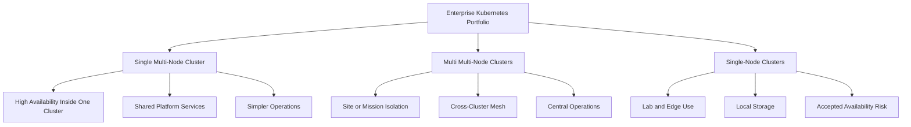

# Cluster Portfolio Strategy

**Public-Safe Reference Architecture**  
**Version:** 2.0  
**Date:** July 1, 2026

This document is the concise decision guide for the K8s Mystical Mesh cluster portfolio. The detailed architecture, implementation context, operational guidance, and formerly separate supporting documents are consolidated into `docs/System-Design-Document.md`.

The platform supports three enterprise Kubernetes cluster categories:

1. **Single multi-node cluster** — one resilient cluster for shared platform or application services.
2. **Multi multi-node clusters** — multiple resilient clusters across sites, missions, or security domains.
3. **Single-node clusters** — constrained lab, edge, demo, or disconnected validation clusters with explicit availability caveats.

## Cluster Category Map

## Category 1: Single Multi-Node Cluster

A single multi-node cluster is the default recommendation when the enterprise needs Kubernetes resiliency but does not need separate cluster fault domains.

| Attribute | Standard |
| --- | --- |
| Control plane | Three or more server nodes |
| Worker capacity | Dedicated worker nodes |
| Storage | External CSI-backed storage preferred |
| Ingress | Redundant ingress replicas |
| Operations | One lifecycle domain |
| Best fit | Department platform, shared services, internal applications |

## Category 2: Multi Multi-Node Clusters

Multi multi-node clusters are used when mission boundaries, sites, security domains, or workload resiliency requirements justify more than one fully resilient cluster.

| Attribute | Standard |
| --- | --- |
| Control plane | Three or more server nodes per cluster |
| Worker capacity | Dedicated worker nodes per cluster |
| Management | Centralized Rancher Manager |
| GitOps | Fleet or Argo CD by target group |
| Observability | Central aggregation with cluster labels |
| Best fit | Enterprise platform, segmented missions, multi-site operations |

## Category 3: Single-Node Clusters

Single-node clusters are valid for labs, edge locations, demos, developer sandboxes, and constrained test environments. They are not equivalent to high-availability production clusters.

| Attribute | Standard |
| --- | --- |
| Control plane | One server node |
| Worker capacity | Co-located on the same node |
| Storage | Local disks or constrained external storage |
| Management | Imported into Rancher for visibility and governance |
| Availability | Host-level fault domain |
| Best fit | Lab, edge, disconnected test, proof-of-concept |

## Decision Matrix

| Requirement | Single Multi-Node | Multi Multi-Node | Single-Node |
| --- | --- | --- | --- |
| High availability | Strong | Strongest | Weak |
| Operational simplicity | Strong | Moderate | Strong |
| Security isolation | Moderate | Strongest | Moderate |
| Cost efficiency | Moderate | Weak | Strong |
| Edge or lab fit | Moderate | Weak | Strong |
| Enterprise governance | Strong | Strongest | Moderate with Rancher |
| Disaster recovery | Moderate | Strong | Manual and backup-driven |

## Enterprise Management Standard

Rancher Manager is the management standard across all three categories. It provides the enterprise operating console for cluster import, lifecycle awareness, RBAC, projects, monitoring views, GitOps targeting, policy posture, and operational inventory.

| Cluster Category | Rancher Use | Guardrail |
| --- | --- | --- |
| Single multi-node cluster | Primary cluster lifecycle, RBAC, projects, monitoring, apps | Use HA storage and redundant ingress. |
| Multi multi-node clusters | Central estate management, Fleet targeting, cross-cluster visibility | Keep cluster labels and ownership clean. |
| Single-node clusters | Import for visibility, policy, inventory, and lifecycle awareness | Do not market as HA. Backup is mandatory. |

## Source of Truth

| Document | Role |
| --- | --- |
| `docs/Cluster-Portfolio-Strategy.md` | Portfolio decision guide |
| `docs/System-Design-Document.md` | Consolidated system design, operations, security, networking, storage, monitoring, and Rancher management reference |

All other previous Markdown documents under `docs/` have been consolidated into the SDD to eliminate drift.
