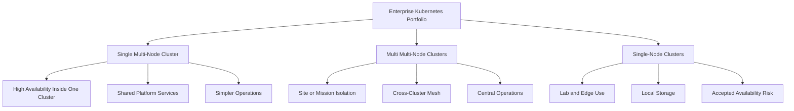
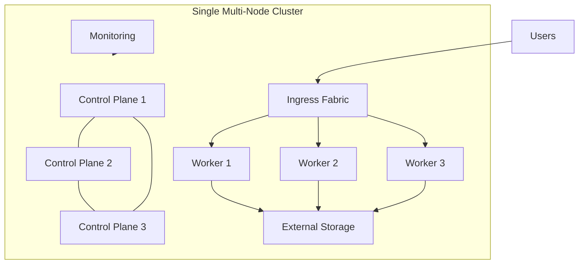
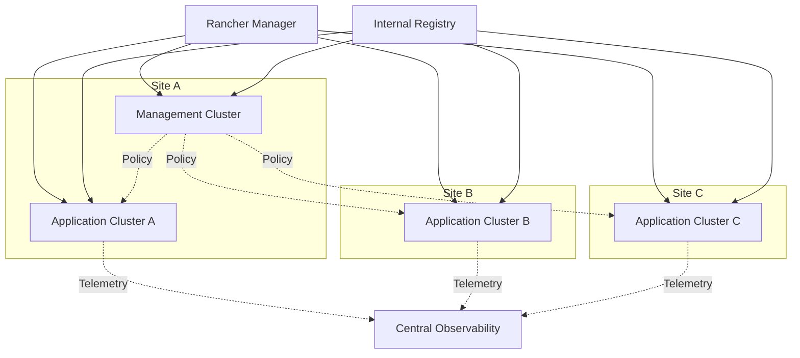
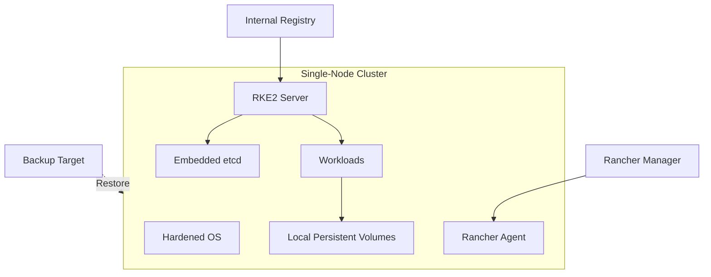

# Cluster Portfolio Strategy

**Public-Safe Reference Architecture**  
**Version:** 1.0  
**Date:** July 1, 2026

This document expands the documentation package to cover three enterprise Kubernetes cluster categories:

1. Single multi-node cluster
2. Multi multi-node clusters
3. Single-node clusters

The goal is to separate deployment patterns by risk, resiliency, management overhead, and operational intent.

## Cluster Category Map

## Category 1: Single Multi-Node Cluster

A single multi-node cluster is the default recommendation when the enterprise needs Kubernetes resiliency but does not need separate cluster fault domains.

| Attribute | Standard |
| --- | --- |
| Control plane | Three or more server nodes |
| Worker capacity | Dedicated worker nodes |
| Storage | External CSI-backed storage preferred |
| Ingress | Redundant ingress replicas |
| Operations | One lifecycle domain |
| Best fit | Department platform, shared services, internal applications |

### Architecture

## Category 2: Multi Multi-Node Clusters

Multi multi-node clusters are used when mission boundaries, sites, security domains, or workload resiliency requirements justify more than one fully resilient cluster.

| Attribute | Standard |
| --- | --- |
| Control plane | Three or more server nodes per cluster |
| Worker capacity | Dedicated worker nodes per cluster |
| Management | Centralized Rancher Manager |
| GitOps | Fleet or Argo CD by target group |
| Observability | Central aggregation with cluster labels |
| Best fit | Enterprise platform, segmented missions, multi-site operations |

### Architecture

## Category 3: Single-Node Clusters

Single-node clusters are valid for labs, edge locations, demos, developer sandboxes, and constrained test environments. They are not equivalent to high-availability production clusters.

| Attribute | Standard |
| --- | --- |
| Control plane | One server node |
| Worker capacity | Co-located on the same node |
| Storage | Local disks or constrained external storage |
| Management | Imported into Rancher for visibility and governance |
| Availability | Host-level fault domain |
| Best fit | Lab, edge, disconnected test, proof-of-concept |

### Architecture

## Decision Matrix

| Requirement | Single Multi-Node | Multi Multi-Node | Single-Node |
| --- | --- | --- | --- |
| High availability | Strong | Strongest | Weak |
| Operational simplicity | Strong | Moderate | Strong |
| Security isolation | Moderate | Strongest | Moderate |
| Cost efficiency | Moderate | Weak | Strong |
| Edge or lab fit | Moderate | Weak | Strong |
| Enterprise governance | Strong | Strongest | Moderate with Rancher |
| Disaster recovery | Moderate | Strong | Manual and backup-driven |

## Documentation Integration Plan

| Source Content | Destination | Action |
| --- | --- | --- |
| Single-node diagrams from the lab branch | `docs/Single-Node-Cluster-Reference.md` | Add public-safe single-node architecture diagrams. |
| Single-node storage model | `docs/Local-Storage-for-Single-Node-Clusters.md` | Add local PV and backup guidance. |
| Rancher cluster lifecycle | `docs/Rancher-Enterprise-Cluster-Management.md` | Add import, RBAC, monitoring, GitOps, and policy flow. |
| Existing multi-cluster system design | `docs/System-Design-Document.md` | Keep as the multi multi-node reference architecture. |
| Existing network matrix | `docs/Network-IP-Matrix.md` | Split into public-safe category examples over time. |

## Recommended Repo Changes

- Keep `docs/System-Design-Document.md` focused on the multi multi-node architecture.
- Add a separate single multi-node reference so teams do not have to reverse-engineer it from the four-cluster model.
- Add a single-node reference with clear availability caveats.
- Remove duplicate Mermaid nodes from existing diagrams during the next export refresh.
- Keep public-safe placeholders in this repo and keep live values in the private implementation repo.
