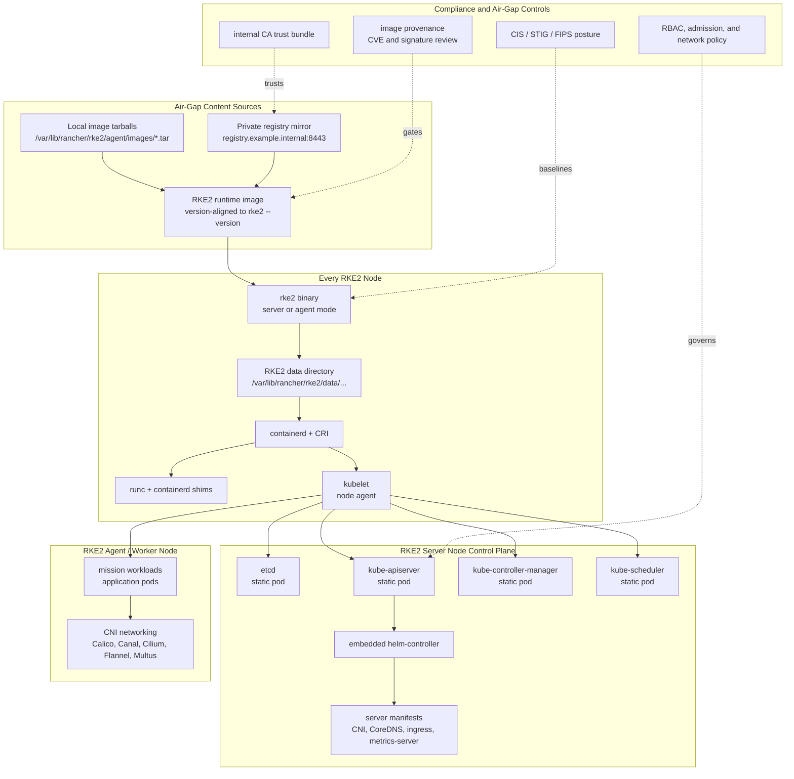

# RKE2 Distribution Architecture Addendum

> **Purpose:** This addendum provides a public-safe RKE2 distribution architecture summary and Mermaid diagram for incorporation into the System Design Document. The diagram is an original architecture representation aligned to the official RKE2 architecture lifecycle, not a verbatim copy of the upstream image.

## Executive Summary

RKE2 is a strong fit for a highly compliant, air-gapped Kubernetes platform because it packages the Kubernetes runtime path into a predictable, supportable node lifecycle. The platform installs a single RKE2 binary on each node, then starts the node in server or agent mode based on configuration. During startup, RKE2 bootstraps the required runtime content, starts and supervises the container runtime and kubelet, and on server nodes brings up the core control-plane components as static pods.

For a government or regulated mission environment, the operational value is straightforward: RKE2 reduces the amount of custom Kubernetes assembly the program has to own. Instead of hand-stitching kubelet, containerd, CNI, control-plane manifests, bootstrap add-ons, and hardening controls, the platform team can standardize around a repeatable distribution pattern that supports offline image staging, private registry mirrors, lifecycle control, and compliance evidence collection.

Source alignment: [RKE2 Architecture](https://docs.rke2.io/architecture).

## RKE2 Node and Bootstrap Architecture

## Design Implications for the K8s Mystical Mesh Platform

- **Air-gap first operating model:** Runtime images, Kubernetes component images, CNI images, and add-on charts should be mirrored and validated before nodes are allowed to bootstrap.
- **Repeatable node lifecycle:** Server and agent nodes can use the same distribution model, with role-specific behavior driven by configuration rather than custom package assembly.
- **Reduced compliance drift:** RKE2 provides a cleaner baseline for CIS/STIG/FIPS-oriented hardening because the runtime, kubelet, and static pod lifecycle are predictable across clusters.
- **Private registry dependency is mission-critical:** The registry mirror becomes a Tier-0 platform dependency in an air-gapped deployment and should receive HA, backup, certificate, and monitoring treatment.
- **Operational ownership remains with the program:** RKE2 lowers distribution burden, but the program still owns cluster configuration, patch cadence, registry hygiene, monitoring, backup, and policy enforcement.

## Suggested System Design Document Placement

Insert this section under `## System Architecture Overview`, after the existing `### Architecture Diagram` and before `### Cluster Overview`.
