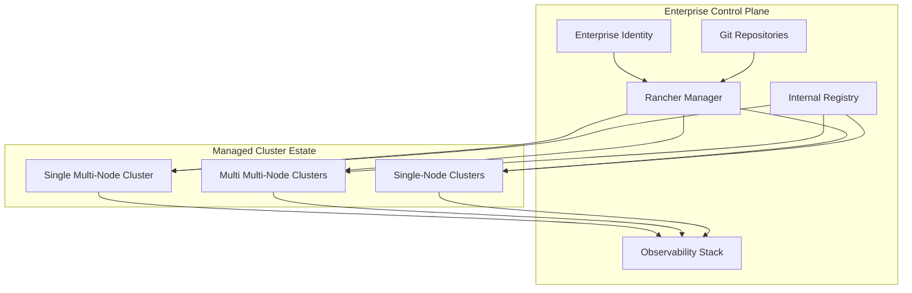
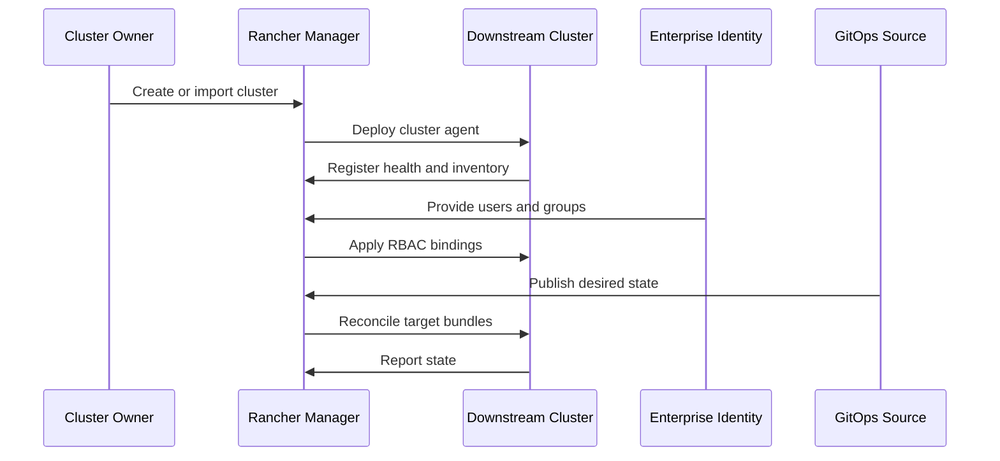
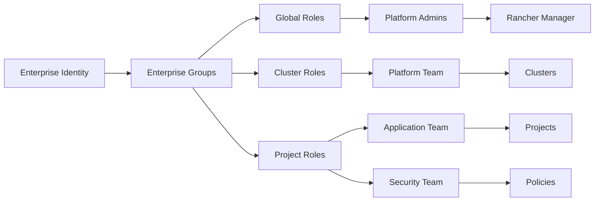
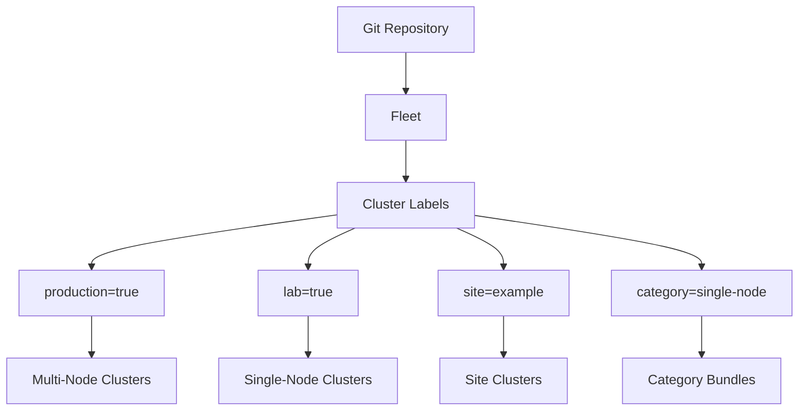

# Rancher Enterprise Cluster Management

**Public-Safe Reference Architecture**  
**Version:** 1.0  
**Date:** July 1, 2026

Rancher Manager is the enterprise control point for clusters in all three categories:

- single multi-node cluster
- multi multi-node clusters
- single-node clusters

The operating principle is simple: Rancher provides centralized visibility, access control, policy alignment, and lifecycle workflows, while each cluster still keeps its own Kubernetes API, workload runtime, and failure domain.

## Management Model

## Rancher UI Operating Areas

| Area | Purpose | Enterprise Outcome |
| --- | --- | --- |
| Cluster Explorer | Inspect workloads, namespaces, nodes, storage, and events | Single pane of glass |
| Cluster Management | Register, import, upgrade, and manage clusters | Standard lifecycle control |
| Users and Authentication | Integrate enterprise identity and groups | Central access governance |
| Projects and Namespaces | Group namespaces with delegated RBAC | Cleaner ownership model |
| Apps and Charts | Deploy approved platform services | Controlled self-service |
| Monitoring | View health and capacity | Faster incident triage |
| Fleet | GitOps deployment to target clusters | Repeatable configuration |
| Security and Policy | Run scans and enforce standards | Audit-ready operations |

## Cluster Onboarding Flow

## RBAC and Ownership Pattern

## Category-Specific Use

| Cluster Category | Rancher Use | Guardrail |
| --- | --- | --- |
| Single multi-node cluster | Primary cluster lifecycle, RBAC, projects, monitoring, apps | Use HA storage and redundant ingress. |
| Multi multi-node clusters | Central estate management, Fleet targeting, cross-cluster visibility | Keep cluster labels and ownership clean. |
| Single-node clusters | Import for visibility, policy, inventory, and lifecycle awareness | Do not market as HA. Backup is mandatory. |

## Fleet Targeting Model

## Lifecycle Responsibilities

| Responsibility | Rancher | Cluster Owner | Platform Team |
| --- | --- | --- | --- |
| Authentication | Owns integration point | Consumes access | Designs group model |
| Cluster import | Provides workflow | Runs registration | Validates health |
| RBAC | Enforces assignments | Requests access | Approves model |
| Monitoring | Provides views | Responds to alerts | Maintains dashboards |
| GitOps | Runs reconciliation | Owns app repos | Owns platform repos |
| Backup | Coordinates visibility | Owns cluster backup | Defines standard |
| Compliance | Surfaces scans | Remediates findings | Owns baseline |

## Documentation Provisions

Add these docs as the portfolio matures:

| Document | Purpose |
| --- | --- |
| `docs/Rancher-Cluster-Onboarding-Runbook.md` | Step-by-step import and validation. |
| `docs/Rancher-RBAC-Model.md` | Enterprise groups, roles, and delegated ownership. |
| `docs/Fleet-Targeting-Standards.md` | Label strategy and bundle targeting. |
| `docs/Cluster-Backup-and-Restore-Standards.md` | Backup expectations by cluster category. |
| `docs/Single-Node-Operations-Runbook.md` | Day-2 operations for constrained clusters. |
| `docs/Cluster-Decommissioning-Runbook.md` | Clean removal from Rancher and platform tooling. |

## Change and Removal Recommendations

- Change the current documentation package from one dominant multi-cluster narrative to a cluster portfolio narrative.
- Keep the existing multi-cluster design, but clearly label it as the multi multi-node reference.
- Add a single multi-node architecture document so smaller enterprise deployments have a clean target pattern.
- Add single-node caveats everywhere single-node clusters are discussed.
- Remove or regenerate duplicated Mermaid nodes from current exported diagrams.
- Avoid putting live hostnames, routable addresses, or private operational secrets into the public documentation repo.
