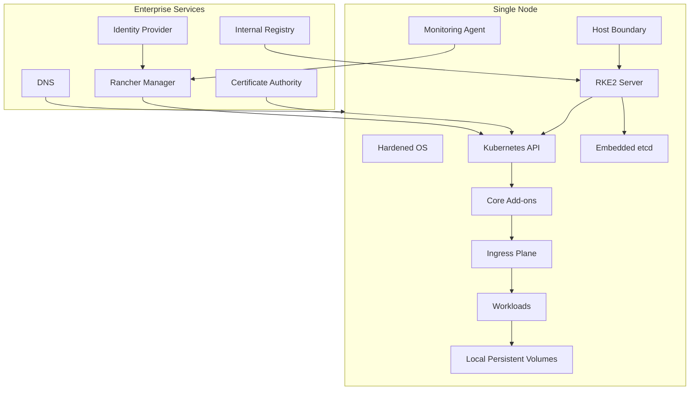
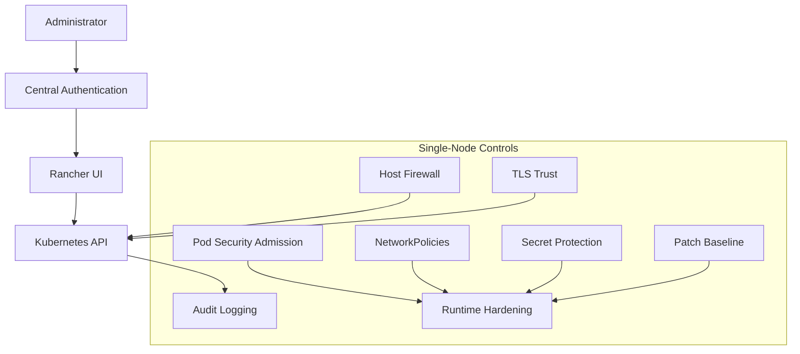
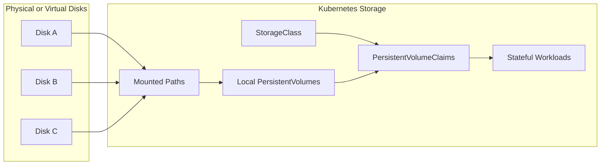
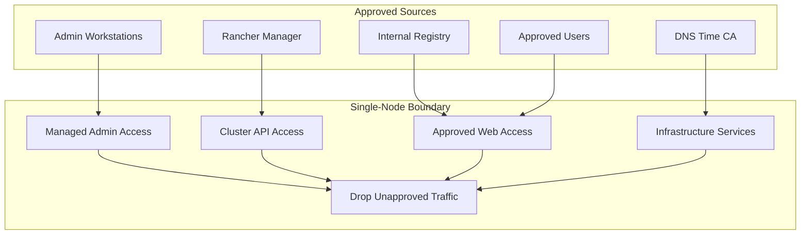
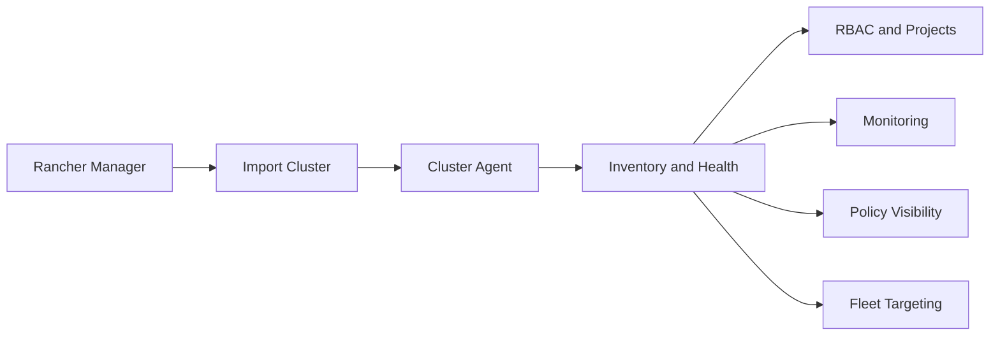

# Single-Node Cluster Reference

**Public-Safe Reference Architecture**  
**Version:** 1.0  
**Date:** July 1, 2026

This document provides the public-safe single-node cluster reference derived from the private lab branch. It keeps live names, addresses, and operational values out of the public documentation repo while preserving the design intent.

## Intended Use

Single-node clusters are suitable for:

- constrained labs
- development sandboxes
- edge-style experiments
- disconnected validation
- proof-of-concept deployments

They are not a substitute for a high-availability production cluster unless the business owner formally accepts the availability and data-durability limitations.

## Reference Architecture

## Security Posture

## Local Storage Model

## Storage Caveat

Local persistent volumes bind workload availability to the health of the node and the local disk. That is acceptable for labs and edge-style validation, but it requires a backup, restore, and rebuild plan before stateful workloads are promoted.

## Firewall Rule Intent

## Rancher Management

## Operational Gates

| Gate | Required Outcome |
| --- | --- |
| OS baseline | Hardened and patched host. |
| Network baseline | Segmented interfaces and explicit allow list. |
| Registry access | Internal registry pull path validated. |
| RKE2 baseline | Server installed with intended profile and config. |
| Storage baseline | Local disks mounted, labeled, and backed up. |
| Ingress baseline | Approved ingress path validated. |
| Rancher baseline | Cluster imported, visible, and governed. |
| Backup baseline | Restore path tested before stateful promotion. |

## Do Not Overstate This Pattern

A single-node cluster is useful, but it is not resilient. The documentation should say that plainly. The trade is cost and simplicity in exchange for a larger failure domain.
