# Multi-Cluster Kubernetes System Design Document

> **Public release rewrite note:** This file was rewritten with public-safe cluster, realm, DNS, path, and IP placeholders. It preserves the platform design intent but is not a live deployment inventory.

**Reference Architecture Environment**  
**Version:** 1.5  
**Date:** May 22, 2026

---

## Table of Contents

1. [Executive Summary](#executive-summary)
2. [System Architecture Overview](#system-architecture-overview)
3. [Infrastructure Components](#infrastructure-components)
4. [Component Deep Dive](#component-deep-dive)
5. [Cluster Topology](#cluster-topology)
6. [Networking Architecture](#networking-architecture)
7. [Security Architecture](#security-architecture)
8. [Storage Architecture](#storage-architecture)
9. [Service Mesh Architecture](#service-mesh-architecture)
10. [Monitoring and Observability](#monitoring-and-observability)
11. [Application Stack](#application-stack)
12. [Deployment Architecture](#deployment-architecture)
13. [Security Best Practices Assessment](#security-best-practices-assessment)
14. [Recommendations and Improvements](#recommendations-and-improvements)
15. [Appendices](#appendices)

---

## Executive Summary

This document describes a sophisticated multi-cluster Kubernetes deployment architecture designed for high availability, service mesh integration, and comprehensive monitoring. The system comprises **four Kubernetes clusters** deployed across multiple sites with advanced networking, storage, and security capabilities.

### Key Characteristics

- **Multi-cluster architecture** with Istio service mesh spanning all clusters
- **Geographic distribution** across three sites (site-b, site-a, site-c)
- **MongoDB multi-cluster replication** for data resilience
- **Centralized monitoring** with Prometheus federation
- **Enterprise-grade storage** with NetApp Trident
- **Microservices deployment** running Rocket.Chat as primary application

### Current Baseline Addendum (April 2026)

For exact deployable defaults, use `docs/Configuration-Baseline.md` as source of truth.

This baseline supersedes older numeric examples in this design document where values differ.
Current operational defaults include:

- Contour ingress controller `replicaCount: 3` with explicit Contour/Envoy resources.
- Rocket.Chat baseline `replicaCount: 4`, `minAvailable: 4`, and microservice replicas at 3.
- Six Rocket.Chat HPAs (main + five microservices).
- Keycloak CRs at `instances: 3` with 1 CPU/2Gi requests and 2 CPU/4Gi limits.
- MongoDB multicluster members increased to 2 per application cluster, with Ops Manager replicas increased to 2.
- Expanded NetworkPolicy coverage (including keycloak variants) and tighter monitoring policy selectors.

---

## System Architecture Overview

### Architecture Diagram

```mermaid
flowchart TB
    subgraph cluster_1_Site_Site_A["Site A"]
        subgraph cluster_2_Site_AM["Management Cluster"]
            Site_AM_ISTIO["Istio Control Plane"]
            Site_AM_PROM["Prometheus Stack<br/>Central Monitoring"]
            Site_AM_MONGO["MongoDB Operator"]
            Site_AM_MONGO_OPS["MongoDB OpsManager"]
            Site_AM_GRAFANA["Grafana Dashboard"]
            Site_AM_ALERT["Alertmanager"]
            Site_AM_ISTIO["Istio Control Plane"]
            Site_AM_PROM["Prometheus Stack<br/>Central Monitoring"]
            Site_AM_MONGO["MongoDB Operator"]
            Site_AM_GRAFANA["Grafana Dashboard"]
            Site_AM_ALERT["Alertmanager"]
        end
        subgraph cluster_3_Site_AD["App Cluster"]
            Site_AD_ISTIO["Istio Control Plane"]
            Site_AD_PROM["Prometheus Agent"]
            Site_AD_ROCKET["Rocket.Chat Pods"]
            Site_AD_MONGO["MongoDB ReplicaSet"]
            Site_AD_ISTIO["Istio Control Plane"]
            Site_AD_PROM["Prometheus Agent"]
            Site_AD_ROCKET["Rocket.Chat Pods"]
            Site_AD_MONGO["MongoDB ReplicaSet"]
        end
    end
    subgraph cluster_4_Site_Site_B["Site B"]
        subgraph cluster_5_Site_BD["App Cluster"]
            Site_BD_ISTIO["Istio Control Plane"]
            Site_BD_PROM["Prometheus Agent"]
            Site_BD_ROCKET["Rocket.Chat Pods"]
            Site_BD_MONGO["MongoDB ReplicaSet"]
            Site_BD_ISTIO["Istio Control Plane"]
            Site_BD_PROM["Prometheus Agent"]
            Site_BD_ROCKET["Rocket.Chat Pods"]
            Site_BD_MONGO["MongoDB ReplicaSet"]
        end
    end
    subgraph cluster_6_Site_Site_C["Site C"]
        subgraph cluster_7_Site_CD["App Cluster"]
            Site_CD_ISTIO["Istio Control Plane"]
            Site_CD_PROM["Prometheus Agent"]
            Site_CD_ROCKET["Rocket.Chat Pods"]
            Site_CD_MONGO["MongoDB ReplicaSet"]
            Site_CD_ISTIO["Istio Control Plane"]
            Site_CD_PROM["Prometheus Agent"]
            Site_CD_ROCKET["Rocket.Chat Pods"]
            Site_CD_MONGO["MongoDB ReplicaSet"]
        end
    end
    subgraph cluster_8_External["<br/><br/><br/><br/><br/><br/>External Services"]
        REGISTRY["Container Registry<br/>registry.example.internal:8443"]
        STORAGE["NetApp Storage<br/>storage.example.internal"]
    end
    Site_AM["Site A Management<br/>Cluster"]
    Site_AD["Site A Domain<br/>Cluster"]
    Site_BD["Site B Domain<br/>Cluster"]
    Site_CD["Site C Domain<br/>Cluster"]
    Site_AM_PROM -.Remote Write.-> Site_AD_PROM
    Site_AM_PROM -.Remote Write.-> Site_BD_PROM
    Site_AM_PROM -.Remote Write.-> Site_CD_PROM
    Site_AM_ISTIO <-.Service Mesh.-> Site_AD_ISTIO
    Site_AM_ISTIO <-.Service Mesh.-> Site_BD_ISTIO
    Site_AM_ISTIO <-.Service Mesh.-> Site_CD_ISTIO
    Site_AD_MONGO <-.Replication.-> Site_BD_MONGO
    Site_AD_MONGO <-.Replication.-> Site_CD_MONGO
    Site_BD_MONGO <-.Replication.-> Site_CD_MONGO
    Site_AM --> REGISTRY
    Site_AD --> REGISTRY
    Site_BD --> REGISTRY
    Site_CD --> REGISTRY
    Site_AM --> STORAGE
    Site_AD --> STORAGE
    Site_BD --> STORAGE
    Site_CD --> STORAGE
    style REGISTRY fill:#ffebee
    style STORAGE fill:#ffebee
```

> Diagram export: [SVG](../diagrams/svg/system-design-document-diagram-01.svg) | [PNG](../diagrams/png/system-design-document-diagram-01.png)

### Cluster Overview

| Cluster | Site | Role | Primary Functions |
| --------- | ------ | ------ | ------------------ |
| **mgmt-cluster** | Site A | Management/Control | MongoDB Operator, Central Monitoring, Istio Primary |
| **app-cluster-a** | Site A | Application | Rocket.Chat, MongoDB ReplicaSet, Istio Data Plane |
| **app-cluster-b** | Site B | Application | Rocket.Chat, MongoDB ReplicaSet, Istio Data Plane |
| **app-cluster-c** | Site C | Application | Rocket.Chat, MongoDB ReplicaSet, Istio Data Plane |

---

## Infrastructure Components

### Core Platform Components

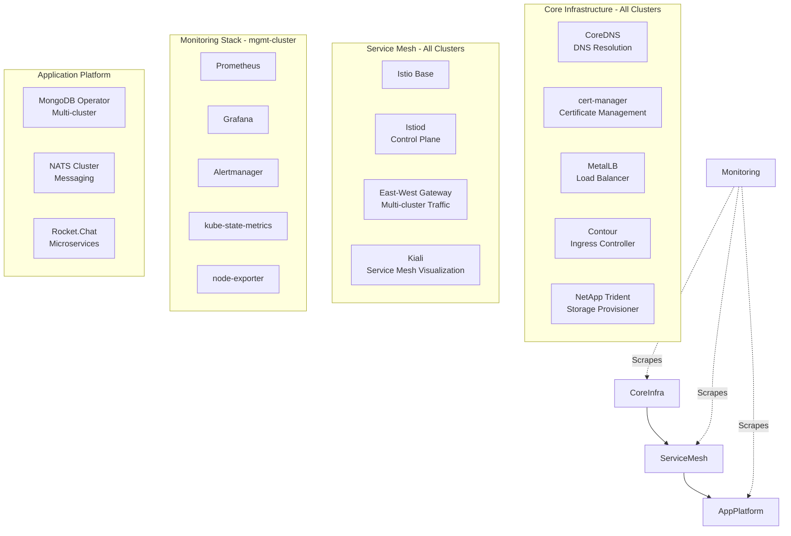

> Diagram export: [SVG](../diagrams/svg/system-design-document-diagram-02.svg) | [PNG](../diagrams/png/system-design-document-diagram-02.png)


### Component Versions

| Component | Version | Registry |
| ----------- | --------- | ---------- |
| **Istio** | 1.27.1 | registry.example.internal:8443/library/istio |
| **cert-manager** | 1.5.14 (Bitnami) | registry.example.internal:8443/library |
| **MetalLB** | 0.15.2 | registry.example.internal:8443/library/metallb |
| **Contour** | 21.1.4 (Bitnami) | registry.example.internal:8443/library |
| **Trident Operator** | 100.2602.0 | registry.example.internal:8443/library/netapp |
| **Trident Protect** | 100.2602.0 | registry.example.internal:8443/library/netapp |
| **Prometheus Stack** | 82.1.0 (kube-prometheus-stack) | registry.example.internal:8443/library |
| **MongoDB Kubernetes** | 1.5.0 | registry.example.internal:8443/library/mongodb |
| **NATS** | 2.12.2 | registry.example.internal:8443/library |
| **Rocket.Chat** | 7.13.1 | registry.example.internal:8443/library/rocketchat |
| **Kiali Operator** | 2.13.0 | registry.example.internal:8443/library |

---

## Component Deep Dive

### Foundational Cluster Services and Traffic Entry Stack

The foundational layer is built as a tightly coupled set of control services that convert raw Kubernetes clusters into deterministic, production-grade runtime domains. CoreDNS is not treated as a default black box; it is patched early because every later subsystem, including service mesh endpoint discovery, certificate issuer lookups, and internal service routing, depends on low-latency, consistent DNS behavior under frequent control-plane updates. The practical implication is that DNS quality directly influences rollout convergence time and failure recovery characteristics. When deployments are spread across four clusters and several namespaces with sidecar interception, DNS jitter and stale cache behavior can amplify into readiness failures, delayed mesh endpoint propagation, and transient cross-cluster timeouts. In this architecture, DNS preparation is therefore an infrastructure gate, not a post-install tuning item.

cert-manager, MetalLB, and Contour then establish the ingress and certificate boundary for application and platform traffic. cert-manager serves as the X.509 automation engine across namespaces, removing manual certificate rotation from operations and making certificate issuance semantics reproducible across sites. MetalLB supplies stable address allocation in bare-metal-style environments where cloud load balancers are unavailable; this effectively turns service exposure into an address-pool management discipline tied to each site and segment. Contour and Envoy provide the policy-aware L7 entry point, but technically they also act as a normalization layer between internal service topology and external consumers, converting diverse backend readiness states into a predictable ingress contract. When these components are installed in sequence and configured from site overlays, they behave as a single ingress fabric: address ownership (MetalLB), cryptographic identity (cert-manager), and HTTP/TCP routing policy (Contour) are separately managed but operationally inseparable.

### Service Mesh Control Plane and Multi-Cluster Transport Semantics

Istio in this environment functions as a distributed traffic operating system rather than a simple sidecar framework. Istiod maintains xDS state for all sidecar and gateway proxies, continuously reconciling desired policy, identity, and routing intent with live workload endpoints. Because each cluster has local control-plane representation while participating in a shared mesh identity model, the system gains fault-containment advantages without giving up cross-cluster traffic capabilities. East-west gateways on port 15443 provide a constrained, mTLS-protected transport corridor for inter-cluster service communication, and remote secret exchange allows API server trust and endpoint advertisement to scale beyond a single cluster scope. This design avoids hard coupling between application namespaces and physical site boundaries while preserving cryptographic verification at every hop.

From a data-plane behavior perspective, sidecars enforce policy close to workloads, which means security and routing decisions are evaluated at connection boundaries where identity and telemetry are richest. Certificate rotation and SPIFFE-style workload identity are handled by mesh PKI integration, reducing the need for application-level certificate mechanics in most services. Operationally, this creates a powerful debugging model: traffic policy, retries, outlier detection, and mTLS posture are inspectable and tunable at the mesh layer without redeploying every application component. In multi-site topologies, this is essential because network asymmetry, partial site degradation, and replica distribution shifts are normal conditions, not exceptions. The mesh absorbs much of this complexity by making transport policy declarative and continuously convergent.

### Persistent Storage Control Plane and Volume Provisioning Path

NetApp Trident provides the storage control-plane abstraction that maps Kubernetes PVC intent into backend ONTAP provisioning workflows across both NFS and iSCSI profiles. The presence of multiple storage classes, including late-binding variants, is architecturally significant: volume binding is deferred until scheduling context is known, which improves placement correctness for stateful workloads and reduces cross-node attachment conflicts. In the monitoring stack, iSCSI-backed persistent volumes for Prometheus and Alertmanager are used to support predictable IOPS and write durability under sustained metric ingestion pressure. Grafana now uses a dedicated PostgreSQL configuration database, also backed by persistent storage, to remove SQLite lock contention and establish a cleaner scale-up path for higher dashboard concurrency and eventual Grafana HA. The storage system is therefore not just capacity infrastructure; it is a performance and failure-domain control surface.

Operationally, Trident also separates day-1 platform installation from day-2 storage policy tuning. Backend definitions, storage classes, and snapshot classes can evolve without rewriting application deployment logic, allowing platform teams to adapt provisioning behavior as workload profiles change. This is especially important in multi-cluster operations where retention settings, backup windows, and IO patterns differ between management and application clusters. By externalizing storage behavior into Trident policy artifacts, the platform keeps stateful services portable at the manifest level while still optimizing the physical storage path underneath.

### Federated Observability Pipeline and Alerting Control Loop

The monitoring system is designed as a federated control loop centered on the management cluster while still collecting high-fidelity telemetry from all service domains. Prometheus in mgmt-cluster is configured with remote write receiver capability and comprehensive ServiceMonitor and PodMonitor coverage, enabling both centralized querying and distributed scrape integration. This arrangement supports a clear operational boundary: application clusters expose metrics and state transitions, while the management cluster performs retention, rule evaluation, and incident signaling. The resulting pipeline minimizes blind spots during cross-cluster faults, because failure signals from ingress, service mesh, messaging, storage, and workloads are normalized into a shared time series corpus.

Grafana and Alertmanager complete the feedback loop by turning telemetry into operator action. Dashboards provide cross-layer correlation views so teams can move from symptom to root cause without context switching across tools, while Alertmanager enforces routing and severity policy for actionable events. Grafana's configuration state is now externalized into PostgreSQL rather than remaining on embedded SQLite, which reduces metadata write contention and aligns the management plane with a more scalable operating model. The technical strength of this model is composability: as new exporters or monitored services are introduced, they can be onboarded through monitor resources and rule definitions without redesigning the entire observability architecture. In a platform that includes mesh policy, stateful replication, and site-level networking variation, this observability control loop is what makes the system operable under real failure conditions.

### MongoDB Multi-Cluster Data Fabric and Replication Behavior

MongoDB is deployed as a multi-cluster replica set coordinated by the MongoDB Kubernetes Operator, with lifecycle operations managed from the control domain and data replicas distributed across application clusters. This separation of concerns allows cluster-level automation to handle member health, reconciliation, and rolling updates while preserving the database replication semantics required for resilience. Cross-cluster replication traffic traverses mesh-enabled paths with TLS expectations, which means data-plane security and routing policies remain consistent with the broader platform transport model. The result is a data fabric that tolerates site disruptions more effectively than single-cluster stateful deployments, provided quorum and latency assumptions are continuously validated.

The operator-centric model also standardizes day-2 database management: user creation, resource tuning, and topology updates are expressed declaratively rather than through ad hoc manual procedures. Exporter integration feeds replication lag and health metrics into Prometheus, allowing replication state to participate in the same alerting and incident workflow as infrastructure components. In practical terms, database reliability is no longer an isolated domain; it is integrated into platform-wide control loops for deployment, telemetry, and security. That integration is critical when application SLOs depend on both write durability and low-latency reads across geographically separated clusters.

### NATS Messaging Substrate and Event Delivery Characteristics

NATS provides the asynchronous messaging substrate for service-to-service decoupling, especially for Rocket.Chat-adjacent microservice workflows where transient backpressure and bursty event traffic are expected. The cluster configuration, exporter integration, and hardening values indicate an operational posture that treats messaging as core infrastructure rather than an optional add-on. Technically, this matters because queue depth, consumer lag, and connection churn often become the earliest indicators of downstream service stress. By instrumenting NATS and integrating those signals into centralized monitoring, the platform can detect systemic pressure before it manifests as user-visible outage.

From a reliability perspective, NATS reduces direct dependency chains between producers and consumers, which improves failure isolation during partial site impairment. With proper policy around resource requests, network segmentation, and security contexts, the messaging tier can sustain localized failures while preserving eventual processing behavior for dependent services. This architecture also supports controlled evolution of application workflows: teams can introduce new consumers, replay logic, or processing tiers without forcing synchronous coupling to existing services. In a multi-cluster environment, that flexibility is a major contributor to both deployment velocity and operational resilience.

### Rocket.Chat Runtime, Dependency Coupling, and Scaling Envelope

Rocket.Chat in this platform is deployed as an application runtime that depends on both the persistent data plane (MongoDB) and the asynchronous control plane (NATS), while ingress and mesh layers mediate external and internal connectivity. This creates a composite scaling envelope: user-facing throughput is not governed by web pod count alone, but by combined behavior across ingress queueing, mesh sidecar overhead, message broker throughput, and replica-set response time. Consequently, performance engineering for Rocket.Chat must be treated as an end-to-end systems exercise. Resource right-sizing, connection pool behavior, and upstream timeout policy should be tuned with awareness of the whole dependency graph rather than isolated container metrics.

Operationally, the service benefits from the platform’s declarative deployment model and observability controls. Health probes, rolling updates, and namespace policies can be managed consistently with other workloads, while telemetry from application pods can be correlated with NATS and MongoDB indicators to distinguish application defects from infrastructure bottlenecks. In distributed reference architecture environments, this alignment is essential: it allows release validation to capture realistic cross-component behavior before production promotion. Rocket.Chat is therefore not just the primary business workload; it is also an integration anchor that validates the fitness of the surrounding platform stack.

### Identity, Access, and Authentication Plane with Keycloak

Keycloak-related deployment artifacts in this repository show an identity plane designed for operator-managed lifecycle, environment-specific realm configuration, and optional bootstrap automation for federation and realm initialization. The technical architecture separates control concerns into install scripts, resource manifests, and bootstrap job logic, enabling identity configuration to be reproducible and versioned alongside the rest of the platform. This is a significant maturity marker because identity often drifts when managed through manual console-only workflows. By expressing realm, integration, and network policy state as code, the platform gains auditability and deterministic recovery characteristics.

In system terms, Keycloak acts as the trust broker between users, applications, and external identity sources. When combined with namespace network policies and certificate management, it can provide a robust authentication path that remains consistent across cluster boundaries. The architectural challenge is maintaining least privilege and secret hygiene while supporting bootstrap and federation automation. The repository’s structure suggests an intent to evolve toward that posture by combining scripted installation, policy controls, and controlled bootstrap jobs. As this layer matures, it will increasingly determine how safely platform services can expose administrative and user-facing endpoints across environments.

---

## Cluster Topology

### Cluster Network Topology

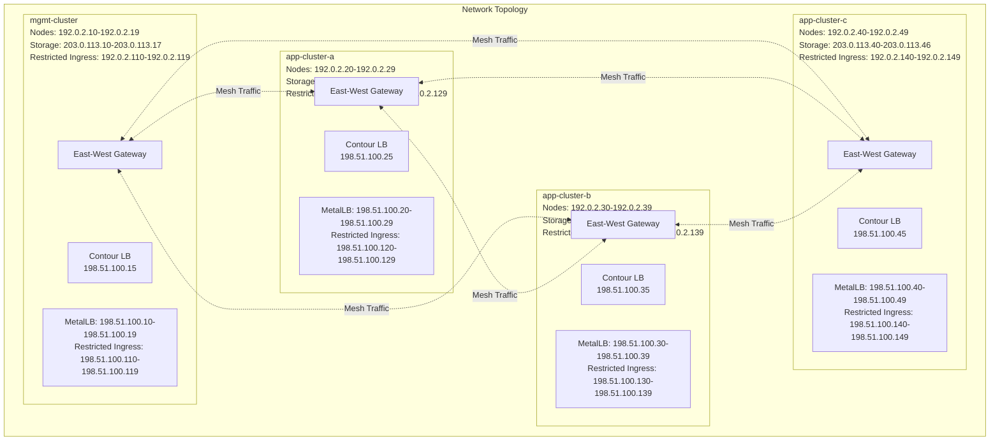

> Diagram export: [SVG](../diagrams/svg/system-design-document-diagram-03.svg) | [PNG](../diagrams/png/system-design-document-diagram-03.png)


### IP Address Allocation

#### Network Port Groups

- **out-of-band-mgmt:** 203.0.113.200-203.0.113.323 (infrastructure management / lab out-of-band management services)
- **platform-net:** 192.0.2.0/24 (Kubernetes Admin, Cluster Nodes, and App Services)
- **storage-net:** 203.0.113.10-203.0.113.47 (Kubernetes Cluster Nodes for Persistent Volumes)
- **restricted-ingress:** 198.51.100.128/25 (Kubernetes Cluster Nodes and App Services)

#### mgmt-cluster Cluster

- **Node IPs (platform-net):** 192.0.2.10-192.0.2.19
- **Storage IPs (storage-net):** 203.0.113.10-203.0.113.17
- **Restricted Ingress IPs:** 192.0.2.110-192.0.2.119
- **Platform MetalLB Pool:** 198.51.100.10-198.51.100.19
- **Restricted Ingress MetalLB Pool:** 198.51.100.110-198.51.100.119
- **Contour LoadBalancer (Domain):** 198.51.100.15
- **Contour LoadBalancer (Restricted Ingress):** 198.51.100.114
- **Cluster Service CIDR:** SERVICE-CIDR-MGMT
- **Pod Network CIDR:** POD-CIDR-MGMT

#### app-cluster-a Cluster

- **Node IPs (platform-net):** 192.0.2.20-192.0.2.29
- **Storage IPs (storage-net):** 203.0.113.20-203.0.113.26
- **Restricted Ingress IPs:** 192.0.2.120-192.0.2.129
- **Platform MetalLB Pool:** 198.51.100.20-198.51.100.29
- **Restricted Ingress MetalLB Pool:** 198.51.100.120-198.51.100.129
- **Contour LoadBalancer (Domain):** 198.51.100.25
- **Contour LoadBalancer (Restricted Ingress):** 198.51.100.124
- **Cluster Service CIDR:** SERVICE-CIDR-APP-A
- **Pod Network CIDR:** POD-CIDR-APP-A

#### app-cluster-b Cluster

- **Node IPs (platform-net):** 192.0.2.30-192.0.2.39
- **Storage IPs (storage-net):** 203.0.113.30-203.0.113.36
- **Restricted Ingress IPs:** 192.0.2.130-192.0.2.139
- **Platform MetalLB Pool:** 198.51.100.30-198.51.100.39
- **Restricted Ingress MetalLB Pool:** 198.51.100.130-198.51.100.139
- **Contour LoadBalancer (Domain):** 198.51.100.35
- **Contour LoadBalancer (Restricted Ingress):** 198.51.100.134
- **Cluster Service CIDR:** SERVICE-CIDR-APP-B
- **Pod Network CIDR:** POD-CIDR-APP-B

#### app-cluster-c Cluster

- **Node IPs (platform-net):** 192.0.2.40-192.0.2.49
- **Storage IPs (storage-net):** 203.0.113.40-203.0.113.46
- **Restricted Ingress IPs:** 192.0.2.140-192.0.2.149
- **Platform MetalLB Pool:** 198.51.100.40-198.51.100.49
- **Restricted Ingress MetalLB Pool:** 198.51.100.140-198.51.100.149
- **Contour LoadBalancer (Domain):** 198.51.100.45
- **Contour LoadBalancer (Restricted Ingress):** 198.51.100.144
- **Cluster Service CIDR:** SERVICE-CIDR-APP-C
- **Pod Network CIDR:** POD-CIDR-APP-C

---

## Networking Architecture

### Load Balancing Architecture

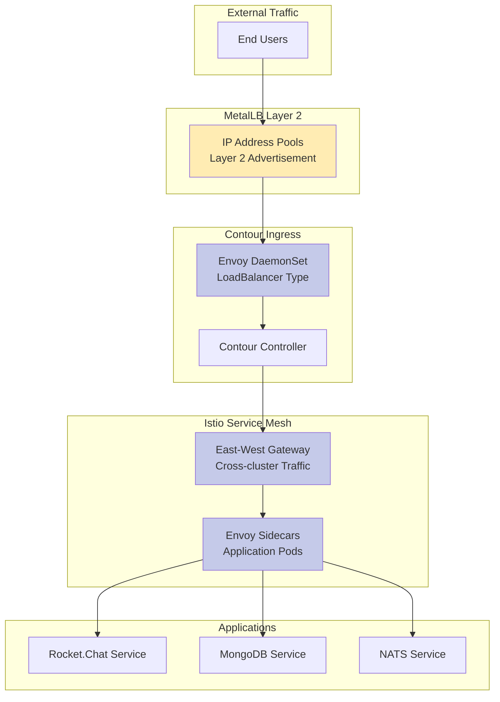

> Diagram export: [SVG](../diagrams/svg/system-design-document-diagram-04.svg) | [PNG](../diagrams/png/system-design-document-diagram-04.png)


### MetalLB Configuration

**Controller Resources:**

- CPU: 50m request / 500m limit
- Memory: 50Mi request / 512Mi limit

**Speaker Configuration:**

- Mode: Layer 2 Advertisement
- FRR Integration: Enabled (v10.4.1)
- CPU: 50m request / 500m limit
- Memory: 50Mi request / 512Mi limit

### Contour Ingress

**Deployment:**

- Controller: 3 replicas
- Envoy: DaemonSet mode
- Service Type: LoadBalancer

---

## Security Architecture

### Certificate Management

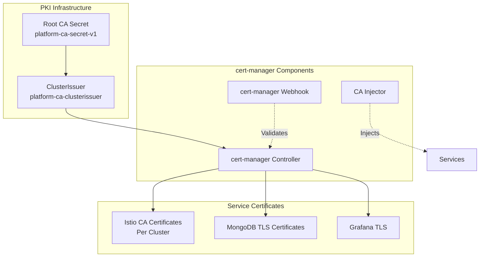

> Diagram export: [SVG](../diagrams/svg/system-design-document-diagram-05.svg) | [PNG](../diagrams/png/system-design-document-diagram-05.png)


### Istio Security Architecture

**Multi-cluster Service Mesh Security:**

- **Mesh ID:** reference-mesh1
- **Trust Domain:** cluster.local
- **Certificate Signers:** clusterissuers.cert-manager.io/platform-ca-clusterissuer
- **mTLS:** Enabled cluster-wide
- **CA Certificates:** Unique per cluster (istio-{site}{cluster}-cacerts)

**Cross-cluster Authentication:**

- Service Account tokens exchanged between clusters
- Remote secrets created for API server access
- Secure east-west gateway communication (port 15443)

### Security Standards

Security hardening is implemented through the STIG automation workflow in `build/install/stigs/deploy-security-hardening.sh` and its supporting policy/value files.

#### STIGS Baseline Controls (Implemented)

| Control Area | Implementation Status | Evidence |
| -------------- | ----------------------- | ---------- |
| Pod security contexts | ✅ Implemented for NATS, Contour/Envoy, Prometheus stack | `build/sites/all/values/nats-cluster-values-v3.yaml`, `build/sites/*/values/contour-values-v4.yaml`, `build/sites/site-a/manager-cluster/values/kube-prometheus-server-values-mgmt-cluster-v9.yaml` |
| Seccomp and least privilege | ✅ RuntimeDefault seccomp and capability drops applied in hardened values | same files as above |
| Network segmentation | ✅ Namespace-specific NetworkPolicies defined for Rocket.Chat, MongoDB, NATS, Monitoring | `build/sites/all/resources/networkpolicy-*.yaml`, `build/sites/site-a/manager-cluster/resources/networkpolicy-monitoring-v1.yaml` |
| Default-deny posture | ✅ Available, optional activation step in STIG script | `build/sites/all/resources/networkpolicy-default-deny-template.yaml` |
| Namespace selector normalization | ✅ Namespace labels standardized for selector matching | `build/install/stigs/deploy-security-hardening.sh` (Step 4) |

#### STIGS Deployment Sequence

The STIG workflow currently runs a 9-step sequence:

1. Harden NATS deployment (`nats-cluster-values-v3.yaml`)
2. Harden Contour across all 4 clusters (`contour-values-v4.yaml`)
3. Harden kube-prometheus-stack (`kube-prometheus-server-values-mgmt-cluster-v9.yaml`)
4. Label namespaces for deterministic selectors
5. Apply Rocket.Chat policies
6. Apply MongoDB policies
7. Apply NATS policies
8. Apply Monitoring policies (mgmt-cluster)
9. Optionally apply default-deny policies

#### Standards Posture

- Runtime hardening controls are implemented at workload/chart level.
- Namespace-level Pod Security Standards enforcement is not yet uniformly enforced cluster-wide and remains a planned hardening phase.

### RBAC Configuration

**Service Accounts:**

- cert-manager controller, webhook, cainjector
- MetalLB controller, speaker
- Contour controller, Envoy
- Istio istiod, gateway
- MongoDB Kubernetes Operator
- Prometheus Operator
- NATS
- Rocket.Chat

**Cluster-level Permissions:**

- MongoDB Operator: cluster-admin role (multi-cluster management)
- Prometheus: Cluster monitoring permissions
- cert-manager: Certificate management across namespaces

---

## Storage Architecture

### NetApp Trident Integration

```mermaid
flowchart TB
    subgraph cluster_1_Storage["NetApp Storage System"]
        SVM["Storage Virtual Machine<br/>tridentSVM"]
        NFS_LIF["NFS Data LIF<br/>storage-data.example.internal"]
        ISCSI_LIF["iSCSI LIF"]
        SVM["Storage Virtual Machine<br/>tridentSVM"]
        NFS_LIF["NFS Data LIF<br/>storage-data.example.internal"]
        ISCSI_LIF["iSCSI LIF"]
    end
    subgraph cluster_2_Trident["Trident Operator"]
        TridentOp["Trident Operator<br/>v100.2602.0"]
        NFSBackend["NFS Backend<br/>ontap-nas"]
        iSCSIBackend["iSCSI Backend<br/>ontap-san"]
        TridentOp["Trident Operator<br/>v100.2602.0"]
        NFSBackend["NFS Backend<br/>ontap-nas"]
        iSCSIBackend["iSCSI Backend<br/>ontap-san"]
    end
    subgraph cluster_3_StorageClasses["Storage Classes"]
        NFSLB["NFS Latebinding<br/>tridentsvm-nfs-latebinding"]
        ISCSILB["iSCSI Latebinding<br/>tkg-work-storage-iscsi-latebinding"]
        NFSLB["NFS Latebinding<br/>tridentsvm-nfs-latebinding"]
        ISCSILB["iSCSI Latebinding<br/>tkg-work-storage-iscsi-latebinding"]
    end
    subgraph cluster_4_Workloads["Persistent Workloads"]
        Prometheus["Prometheus<br/>150Gi iSCSI"]
        Alertmanager["Alertmanager<br/>120Gi iSCSI"]
        MongoDB["MongoDB<br/>NFS/iSCSI"]
        NATS["NATS<br/>1Gi NFS"]
        Prometheus["Prometheus<br/>150Gi iSCSI"]
        Alertmanager["Alertmanager<br/>120Gi iSCSI"]
        MongoDB["MongoDB<br/>NFS/iSCSI"]
        NATS["NATS<br/>1Gi NFS"]
    end
    SVM --> NFS_LIF
    SVM --> ISCSI_LIF
    NFS_LIF --> NFSBackend
    ISCSI_LIF --> iSCSIBackend
    NFSBackend --> NFSLB
    iSCSIBackend --> ISCSILB
    NFSLB --> MongoDB
    NFSLB --> NATS
    ISCSILB --> Prometheus
    ISCSILB --> Alertmanager
    ISCSILB --> MongoDB
```

> Diagram export: [SVG](../diagrams/svg/system-design-document-diagram-06.svg) | [PNG](../diagrams/png/system-design-document-diagram-06.png)


### Storage Backend Configuration

**NFS Backend (ontap-nas):**

- Driver: ontap-nas
- Management LIF: storage.example.internal
- Data LIF: storage-data.example.internal
- SVM: tridentSVM
- Auto Export Policy: Enabled
- Credentials: Kubernetes Secret (tridentsvm-credentials-secret)

**iSCSI Backend (ontap-san):**

- Driver: ontap-san
- Management LIF: storage.example.internal
- SVM: tridentSVM
- CHAP: Not configured (recommended to enable)
- Credentials: Kubernetes Secret (tridentsvm-credentials-secret)

### Storage Classes

| Storage Class | Provisioner | Access Mode | Use Case |
| --------------- | ------------- | ------------- | ---------- |
| tridentsvm-nfs-latebinding | ontap-nas | RWX | Shared storage, NATS |
| tkg-work-storage-iscsi-latebinding | ontap-san | RWO | Block storage, databases |
| tkg-work-storage-latebinding | N/A | RWO | General purpose |

---

## Service Mesh Architecture

### Istio Multi-cluster Configuration

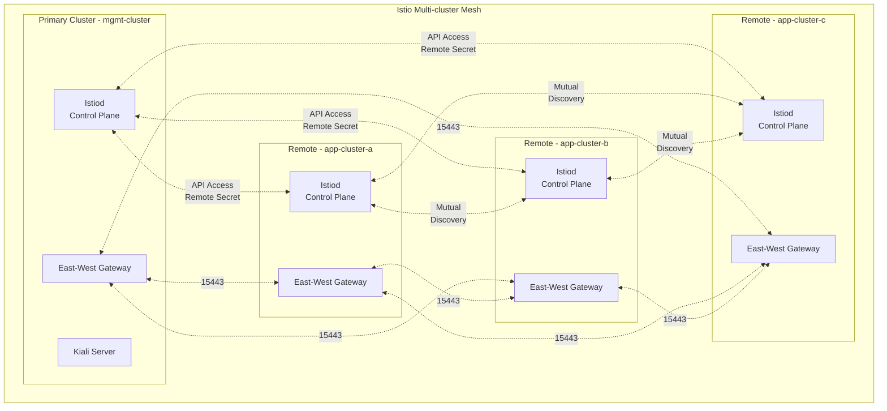

> Diagram export: [SVG](../diagrams/svg/system-design-document-diagram-07.svg) | [PNG](../diagrams/png/system-design-document-diagram-07.png)


### Mesh Networks Configuration

| Network | Cluster | Gateway Address (Domain) | Gateway Address (Restricted Ingress) | Port |
| --------- | --------- | ------------------------- | ---------------------------- | ------ |
| mgmt-net | mgmt-cluster | Via MetalLB Pool | Via MetalLB Pool | 15443 |
| app-a-net | app-cluster-a | Via MetalLB Pool | Via MetalLB Pool | 15443 |
| app-b-net | app-cluster-b | Via MetalLB Pool | Via MetalLB Pool | 15443 |
| app-c-net | app-cluster-c | Via MetalLB Pool | Via MetalLB Pool | 15443 |

**Note:** East-west gateways use LoadBalancer services assigned from MetalLB pools. platform network uses platform-net IPs (198.51.100.x), while restricted-ingress uses alternative network IPs (198.51.100.x).

### Istio Components Resources

**Istiod (Control Plane):**

- CPU: 100m request / 1000m limit
- Memory: 128Mi request / 1024Mi limit
- Logging Level: debug
- Revision: stable

**East-West Gateway:**

- Deployment per cluster
- Dedicated gateway for cross-cluster traffic
- Port 15443 (TLS)

**Proxy (Sidecars):**

- CPU: 100m request / 1000m limit
- Memory: 128Mi request / 512Mi limit
- Log Level: debug

### Kiali Visualization

**Deployment:**

- Kiali Operator: 2.13.0
- Kiali Server: 2.13.0
- Namespace: istio-system
- Provides service mesh topology and health visualization

---

## Monitoring and Observability

### Monitoring Architecture

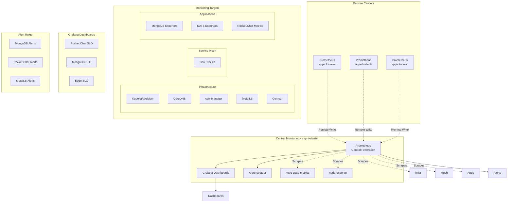

> Diagram export: [SVG](../diagrams/svg/system-design-document-diagram-08.svg) | [PNG](../diagrams/png/system-design-document-diagram-08.png)


### Prometheus Configuration (mgmt-cluster)

**Resource Allocation:**

- CPU: 1 core request / 6 cores limit
- Memory: 4Gi request / 12Gi limit
- Replicas: 1

**Storage:**

- Type: Persistent Volume (iSCSI)
- Size: 150Gi
- Storage Class: tkg-work-storage-iscsi-latebinding
- Retention: 8d

**Scrape Configuration:**

- Scrape Interval: 15s
- Scrape Timeout: 10s
- Evaluation Interval: 15s
- Remote Write Receiver: Enabled

**Features:**

- Remote write receiver endpoint published at `https://prometheus-rw.platform.example.internal/api/v1/write`
- Cluster labeling is injected via `additionalScrapeConfigs` relabeling (`cluster: mgmt-cluster`)

### ServiceMonitors Configured

| Name | Namespace | Selector | Endpoint | Interval |
| ------ | ----------- | ---------- | ---------- | ---------- |
| **rocketchat** | rocketchat | app.kubernetes.io/name: rocketchat | /metrics | 30s |
| **mongodb-rocketchat** | mongodb | app.kubernetes.io/name: mongodb-exporter | /metrics | 30s |
| **metallb-controller** | metallb-system | component: controller | /metrics | 30s |
| **metallb-speaker** | metallb-system | component: speaker | /metrics | 30s |
| **nats-exporter** | nats-system | app.kubernetes.io/name: prometheus-nats-exporter | /metrics | 15s |
| **cert-manager** | cert-manager | app.kubernetes.io/name: cert-manager | /metrics | 30s |
| **contour** | contour | app.kubernetes.io/name: contour | /metrics | 30s |
| **istiod** | istio-system | app=istiod, istio.io/rev=stable | /metrics | 15s |
| **Istio sidecars** | app namespaces | `security.istio.io/tlsMode=istio` | /stats/prometheus | 15s |
| **istio-eastwestgateway** | istio-system | selector key `istio` exists | /stats/prometheus | 15s |

### PodMonitors Configured

| Name | Namespaces | Selector | Endpoint | Interval |
| ------ | ------------ | ---------- | ---------- | ---------- |
| **istio-proxies** | ALL | istio-prometheus-scrape: 'true' | /stats/prometheus | 15s |

### Kubelet Monitoring

**Enabled Components:**

- kubelet metrics
- cAdvisor metrics (15s interval, 7s timeout)
- Resource metrics
- Track timestamps staleness: false

### Grafana Configuration

**Resource Allocation:**

- CPU: 100m request / 500m limit
- Memory: 256Mi request / 1Gi limit

**Configuration:**

- Domain: grafana.platform.example.internal
- Root URL: <https://grafana.platform.example.internal>
- Admin Credentials: Kubernetes Secret (grafana-admin-credentials)

**Sidecar Configuration:**

- Dashboards: Enabled (label: grafana_dashboard)
- Datasources: Enabled
- Search Namespace: ALL

### Alertmanager Configuration

**Resource Allocation:**

- CPU: 100m request / 500m limit
- Memory: 128Mi request / 512Mi limit
- Replicas: 1

**Storage:**

- Type: Persistent Volume (iSCSI)
- Size: 120Gi
- Storage Class: tkg-work-storage-iscsi-latebinding
- Retention: 120h

### Monitoring Dashboards

#### Rocket.Chat SLO Dashboard

**Metrics:**

- API Availability (5xx error budget)
- API Latency p95
- API 5xx Error Rate
- Request duration histograms

**Queries:**

```promql
# Availability
100 - (100 * sum(rate(http_requests_total{job="rocketchat",status=~"5.."}[5m])) / sum(rate(http_requests_total{job="rocketchat"}[5m])))

# P95 Latency
histogram_quantile(0.95, sum by (le) (rate(http_request_duration_seconds_bucket{job="rocketchat",route=~"/api/.*"}[5m])))
```

#### MongoDB SLO Dashboard

**Metrics:**

- Replication Lag p95 (seconds)
- Replication Lag per Member
- Active Connections
- Replica Set Health

**Queries:**

```promql
# Replication Lag
quantile_over_time(0.95, max by (cluster, replicaset) (mongodb_mongod_replset_member_replication_lag{app_kubernetes_io_instance="rocketchat"})[1h])
```

### Alert Rules

Two rule bundles are maintained under `build/monitoring/rules`:

- `prometheus-multicluster-infrastructure-alerts.yaml`
- `prometheus-multicluster-app-alerts.yaml`

Current rule groups and coverage:

- `nats.rules`: NATSServerDown, NATSSlowConsumers, NATSHighMessageRate, NATSConnectionsHigh
- `contour.rules`: ContourBackendUnhealthy, ContourHighErrorRate, ContourHighLatency
- `istio-control-plane.rules`: IstiodDown, IstioPilotPushErrors, IstioCertificateExpiringSoon, IstioProxyVersionMismatch
- `storage.rules`: PersistentVolumeNearFull, PersistentVolumeFull, TridentBackendUnhealthy
- `cert-manager.rules`: CertManagerCertificateExpiringSoon, CertManagerCertificateExpired, CertManagerACMEAccountRegistrationFailed
- `mongodb-operator.rules`: MongoDBOperatorDown, MongoDBOperatorReconcileErrors
- `mongodb-replication.rules`: MongoReplicationLagHigh, MongoReplicationLagCritical
- `rocketchat-api.rules`: RocketChatApiLatencyHigh, RocketChatApiErrorRateHigh
- `metallb-bgp.rules`: MetalLBBgpSessionDown, MetalLBBgpSessionFlapping

Representative expressions from application and edge groups:

#### MongoDB Replication Alerts

**MongoReplicationLagHigh (Warning):**

```yaml
expr: max by (cluster, replicaset) (mongodb_mongod_replset_member_replication_lag{app_kubernetes_io_instance="rocketchat"}) > 10
for: 5m
severity: warning
```

**MongoReplicationLagCritical (Critical):**

```yaml
expr: max by (cluster, replicaset) (mongodb_mongod_replset_member_replication_lag{app_kubernetes_io_instance="rocketchat"}) > 60
for: 5m
severity: critical
```

#### Rocket.Chat API Alerts

**RocketChatApiLatencyHigh (Warning):**

```yaml
expr: histogram_quantile(0.95, sum by (le, cluster) (rate(http_request_duration_seconds_bucket{job="rocketchat",route=~"/api/.*"}[5m]))) > 0.5
for: 10m
severity: warning
```

**RocketChatApiErrorRateHigh (Critical):**

```yaml
expr: (sum(rate(http_requests_total{job="rocketchat",status=~"5.."}[5m])) / sum(rate(http_requests_total{job="rocketchat"}[5m]))) > 0.01
for: 5m
severity: critical
```

#### MetalLB Alerts

**MetalLBBgpSessionDown (Critical):**

```yaml
expr: metallb_bgp_session_up == 0
for: 1m
severity: critical
```

**MetalLBBgpSessionFlapping (Warning):**

```yaml
expr: changes(metallb_bgp_session_up[5m]) > 4
for: 5m
severity: warning
```

### kube-state-metrics

**Resource Allocation:**

- CPU: 50m request / 500m limit
- Memory: 100Mi request / 512Mi limit

**Metrics Exposed:**

- Deployment status
- Pod status
- Node status
- ReplicaSet status
- StatefulSet status
- DaemonSet status
- Service status
- ConfigMap/Secret counts

### node-exporter

**Deployment:** DaemonSet on all nodes

**Resource Allocation:**

- CPU: 50m request / 500m limit
- Memory: 50Mi request / 512Mi limit

**Metrics Exposed:**

- Node CPU usage
- Node memory usage
- Node disk I/O
- Node network I/O
- Node filesystem metrics

---

## Application Stack

### MongoDB Multi-cluster Architecture

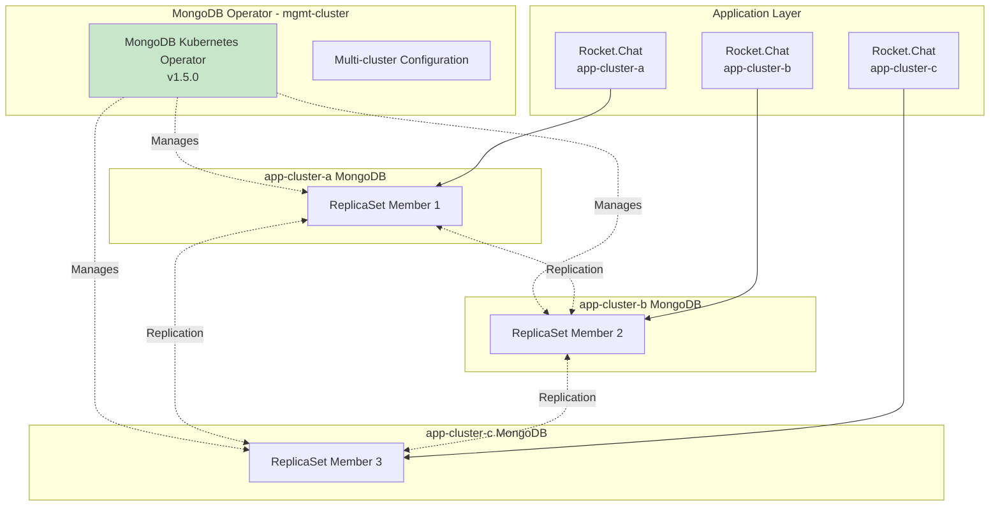

> Diagram export: [SVG](../diagrams/svg/system-design-document-diagram-09.svg) | [PNG](../diagrams/png/system-design-document-diagram-09.png)


### MongoDB Operator Configuration

**Deployment:**

- Namespace: mongodb-operator (all clusters)
- Version: 1.5.0
- Multi-cluster: Enabled

**Multi-cluster Settings:**

```yaml
clusters: [mgmt-cluster, app-cluster-a, app-cluster-b, app-cluster-c]
kubeConfigSecretName: mongodb-enterprise-operator-multi-cluster-kubeconfig
performFailOver: true
clusterClientTimeout: 10
needsCAInfrastructure: true
```

**Operator Resources:**

- CPU: 500m request / 1 core limit
- Memory: 300Mi request / 1Gi limit
- Replicas: 1

**Security:**

- managedSecurityContext: false
- Vault Secret Backend: Disabled

**Watched Resources:**

- opsmanagers
- mongodb
- mongodbmulticluster
- mongodbusers

### MongoDB ReplicaSet

**Configuration:**

- Multi-cluster replication across 3 sites
- TLS Enabled with CA bundle
- MongoDB Exporter for Prometheus metrics
- Persistent storage via Trident

**Connection String:**

```text
mongodb://[credentials]@mongodb-service?ssl=true&tlsCAFile=/etc/ssl/mongo/ca.pem
```

### NATS Cluster

**Deployment:**

- Namespace: nats-system
- Version: 2.12.2
- Mode: Cluster (3 replicas)

**Cluster Configuration:**

```yaml
cluster:
  enabled: true
  port: 6222
  replicas: 3
  useFQDN: true
```

**TLS Configuration:**

- Client port 4222 uses `nats-client-tls` issued by `platform-ca-clusterissuer`.
- Cluster route port 6222 uses `nats-cluster-tls` with per-pod StatefulSet DNS SANs.
- Rocket.Chat uses `tls://nats.nats-system.svc.cluster.local:4222` and mounts `rocketchat-nats-ca-secret` for Node.js CA trust.
- Client traffic is TLS encrypted with server authentication; client certificate authentication is reserved for a future mTLS hardening pass.

**Monitoring:**

- Port: 8222
- Prometheus Exporter: Enabled (port 7777, PodMonitor enabled)

**Storage:**

- PVC Enabled: true
- Size: 1Gi
- Storage Class: tridentsvm-nfs-latebinding

**Resources:**

- CPU: 100m request / 500m limit
- Memory: 128Mi request / 360Mi limit

### Rocket.Chat Microservices

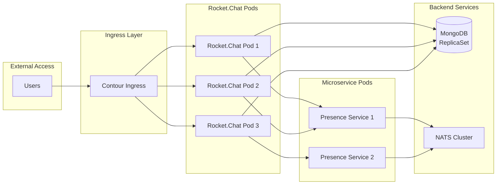

> Diagram export: [SVG](../diagrams/svg/system-design-document-diagram-10.svg) | [PNG](../diagrams/png/system-design-document-diagram-10.png)


**Deployment:**

- Namespace: rocketchat
- Version: 7.13.1
- Replicas: 4 (main), 3 (microservices)
- Min Available: 4

**Anti-affinity:**

```yaml
requiredDuringSchedulingIgnoredDuringExecution:
  topologyKey: kubernetes.io/hostname
```

**Resources (Main Pods):**

- CPU: 250m request / 2 cores limit
- Memory: 2Gi request / 4Gi limit

**Resources (Presence Microservice):**

- CPU: 250m request / 500m limit
- Memory: 512Mi request / 1Gi limit

**MongoDB Integration:**

- External MongoDB: Enabled
- TLS: Enabled
- CA Bundle: Mounted at /etc/ssl/mongo
- Connection managed via Kubernetes Secret

**Monitoring:**

- Metrics Port: HTTP (Prometheus scraping)
- ServiceMonitor: Configured

---

## Deployment Architecture

### Deployment Sequence

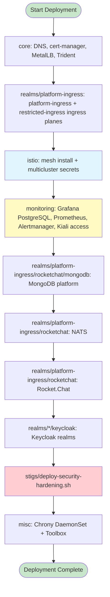

> Diagram export: [SVG](../diagrams/svg/system-design-document-diagram-11.svg) | [PNG](../diagrams/png/system-design-document-diagram-11.png)


### Deployment Scripts

**Main Orchestration:**

- Script template: `build/install/deploy-cluster-template.sh`
- Parameters: SITE, CLUSTER
- Base Directory: `/opt/k8s-mystical-mesh/build/install`
- Notes: copy the template per cluster and call scripts from current subdirectories (`core`, `istio`, `monitoring`, `realms/*`, `stigs`). The detailed rebuild order is in `docs/How-to-deploy-a-K8s-Mystical-Mesh multicluster.md`.

**Deployment Steps:**

| Step | Script | Component | Description |
| ------ | -------- | ----------- | ------------- |
| core/00 | `core/00-patch-coredns.sh` | CoreDNS | Apply RKE2 DNS patches |
| core/01 | `core/01-install-cert-manager.sh` | cert-manager | Install certificate management |
| core/02 | `core/02-install-metallb.sh` | MetalLB | Install load balancer |
| core/04-06 | `core/04-06` scripts | Trident | Install and configure Trident + Protect |
| realms/platform-ingress/01 | `realms/platform-ingress/01-install-platform-ingress-ingress.sh` | Contour | Install standard platform-ingress ingress plane |
| realms/platform-ingress/02 | `realms/platform-ingress/02-install-platform-ingress-restricted-ingress.sh` | Contour | Install segmented ingress plane |
| istio/01-04 | `istio/01-04` scripts | Istio | Configure CA, install mesh, configure secrets, verify |
| monitoring/00-05 | `monitoring/00-05` scripts | Observability | Grafana PostgreSQL, Prometheus, dashboards, rules, Kiali Grafana access |
| realms/platform-ingress/rocketchat/mongodb | `realms/platform-ingress/rocketchat/mongodb/*.sh` | MongoDB | Multi-cluster database setup |
| realms/platform-ingress/rocketchat/19 | `realms/platform-ingress/rocketchat/19-install-nats-cluster.sh` | NATS | Install messaging system |
| realms/platform-ingress/rocketchat/20 | `realms/platform-ingress/rocketchat/20-install-rocketchat.sh` | Rocket.Chat | Install application |
| realms/*/keycloak | `realms/*/keycloak/*.sh` | Identity | Install Keycloak PostgreSQL, operator, CRs, protection, policies |
| stigs | `stigs/deploy-security-hardening.sh` | Security | Apply hardening policies last |
| misc/chrony | `build/misc/chrony/chrony-daemonset.yaml` | Time Sync | Optional host time sync daemonset |
| misc/toolbox | `build/misc/toolbox/deploy-ultimate-toolbox-v1.sh` | Operations | Optional toolbox deployment for cluster troubleshooting |

### Configuration Management

**Structure:**

```text
build/sites/
├── all/                    # Shared configurations
│   ├── values/             # Common Helm values
│   └── resources/          # Common K8s resources
│       └── keycloak-networkpolicies/
├── site-a/
│   ├── manager-cluster/    # mgmt-cluster specific
│   │   ├── values/
│   │   └── resources/
│   └── domain-cluster/     # app-cluster-a specific
│       ├── values/
│       └── resources/
├── site-b/
│   └── domain-cluster/
│       ├── values/
│       └── resources/
└── site-c/
  ├── domain-cluster/
  │   ├── values/
  │   └── resources/
  └── reference-cluster/
    ├── values/
    └── resources/
```

**Helm Charts:**

- Location: `helm/packages`
- Format: Packaged .tgz files
- Registry: registry.example.internal:8443/library

---

## Security Best Practices Assessment

### ✅ Current Security Strengths

1. **Certificate and Transport Security:**
   - ✅ Centralized cert-manager with ClusterIssuer
   - ✅ Automated certificate lifecycle
   - ✅ Istio mTLS enabled cluster-wide
   - ✅ TLS-enabled service paths for critical platform components

2. **STIGS Pod Hardening Controls:**
   - ✅ Non-root execution configured for hardened workloads
   - ✅ `allowPrivilegeEscalation: false` for hardened components
   - ✅ `capabilities.drop: [ALL]` with minimal exceptions (Envoy `NET_BIND_SERVICE`)
   - ✅ `seccompProfile: RuntimeDefault` configured in hardened values

3. **Network Segmentation Controls:**
   - ✅ Namespace-specific NetworkPolicies for Rocket.Chat, MongoDB, NATS, Monitoring
   - ✅ Default-deny policy templates available and automatable
   - ✅ Namespace label standardization for deterministic policy selectors

4. **RBAC and Supply-Chain Controls:**
   - ✅ Service accounts across platform components
   - ✅ Role-based access boundaries with namespace scoping where appropriate
   - ✅ Private registry usage with pinned versions for core deployments

### ⚠️ Security Gaps and Priorities

#### 1. Pod Security Standards Enforcement Consistency - **HIGH PRIORITY**

**Issue:** Namespace-level PSS enforcement is not uniformly enforced across all operational namespaces.

**Recommendation:** Apply staged enforcement (`warn`/`audit` then `enforce`) per namespace tier:

```yaml
pod-security.kubernetes.io/enforce: baseline
pod-security.kubernetes.io/audit: baseline
pod-security.kubernetes.io/warn: baseline
```

#### 2. Default-Deny Activation Coverage - **HIGH PRIORITY**

**Issue:** Default-deny policies are optional in the STIG script (Step 9), so posture may differ by cluster/state.

**Recommendation:** Make default-deny mandatory for app namespaces after policy validation and rollout testing.

#### 3. Workload Hardening Parity - **MEDIUM PRIORITY**

**Issue:** Some workload value files (for example selected reference Postgres overlays) still include permissive security settings.

**Recommendation:** Standardize `runAsNonRoot`, seccomp, and capability policies across all charts/overlays.

#### 4. Storage Security - **MEDIUM PRIORITY**

**Issue:** iSCSI backend CHAP hardening is still not enabled.

**Recommendation:** Enable bidirectional CHAP for Trident SAN backends.

#### 5. Secret Management - **MEDIUM PRIORITY**

**Issue:** Sensitive data remains primarily in Kubernetes Secrets.

**Recommendation:** Introduce external secret management (for example Vault integration) for high-value credentials.

#### 6. Quotas and Policy-as-Code - **MEDIUM PRIORITY**

**Issue:** Namespace ResourceQuotas and admission guardrails are not consistently enforced.

**Recommendation:** Add ResourceQuotas/LimitRanges and policy engines (OPA/Gatekeeper or Kyverno) for guardrail enforcement.

---

## Recommendations and Improvements

### Security and Monitoring Continuous Improvements - **HIGH PRIORITY**

#### 1. Enforce Namespace PSS as an Operational Baseline

**Current State:** Workload-level controls are implemented, but namespace enforcement remains inconsistent.

**Recommendation:** Roll out baseline PSS (`warn`/`audit` then `enforce`) for application namespaces, then evaluate restricted for compatible workloads.

#### 2. Make Default-Deny NetworkPolicies Standard

**Current State:** Default deny is template-driven and optional at deployment time.

**Recommendation:** Add default-deny rollout to mandatory cluster hardening for application namespaces after validation tests.

#### 3. Complete SecurityContext Parity Across Remaining Workloads

**Current State:** Core platform components are hardened; selected overlay values still require normalization.

**Recommendation:** Align all workload charts with the STIG baseline:

- `runAsNonRoot: true`
- `allowPrivilegeEscalation: false`
- `capabilities.drop: [ALL]`
- `seccompProfile.type: RuntimeDefault`

#### 4. Improve Security Observability and Drift Detection

**Recommendation:** Add automated conformance checks (CI or periodic jobs) that verify:

- required pod/container security context keys exist
- required NetworkPolicies exist per namespace
- namespace labels for selector matching remain intact

#### 5. Expand Alert Coverage for Security-Relevant Conditions

**Recommendation:** Add and tune alerts for certificate expiry, policy drift, and unexpected privileged settings.

Example alert candidates:

```yaml
# Istio Alerts
- alert: IstioCertificateExpiringSoon
  expr: (istio_cert_expiration_timestamp - time()) < 86400 * 30
  for: 1h
  severity: warning

- alert: IstioGatewayDown
  expr: up{job="istio-eastwestgateway"} == 0
  for: 5m
  severity: critical

# Storage Alerts
- alert: PersistentVolumeNearFull
  expr: kubelet_volume_stats_used_bytes / kubelet_volume_stats_capacity_bytes > 0.85
  for: 10m
  severity: warning

# NATS Alerts
- alert: NATSSlowConsumer
  expr: nats_slow_consumers > 0
  for: 5m
  severity: warning

- alert: NATSHighLatency
  expr: nats_latency_seconds > 1
  for: 10m
  severity: warning
```

### Performance Optimizations

#### 1. Resource Right-sizing

**Recommendation:** Review and adjust resource allocations based on actual usage:

```yaml
# Example: Increase Prometheus based on metrics volume
prometheus:
  prometheusSpec:
    resources:
      requests:
        cpu: 2          # Increase from 1
        memory: 8Gi     # Increase from 4Gi
      limits:
        memory: 16Gi    # Increase from 12Gi
    storageSpec:
      volumeClaimTemplate:
        spec:
          resources:
            requests:
              storage: 200Gi  # Increase from 150Gi
```

#### 2. Enable Prometheus Remote Write for Federation

**Current:** Using remote write receiver but not optimized

**Recommendation:** Configure remote write with proper settings:

```yaml
# Domain clusters should remote write to manager
remoteWrite:
- url: https://prometheus-rw.platform.example.internal/api/v1/write
  queueConfig:
    capacity: 10000
    maxShards: 50
    minShards: 1
    maxSamplesPerSend: 5000
    batchSendDeadline: 5s
    minBackoff: 30ms
    maxBackoff: 100ms
  writeRelabelConfigs:
  - sourceLabels: [__name__]
    regex: 'up|node_.*|kube_.*|mongodb_.*|rocketchat_.*'
    action: keep
```

#### 3. Optimize Istio Proxy Resources

**Current:** Static resource allocation for all proxies

**Recommendation:** Implement resource annotations per workload:

```yaml
# High-traffic workloads (Rocket.Chat)
annotations:
  sidecar.istio.io/proxyCPU: "200m"
  sidecar.istio.io/proxyMemory: "256Mi"
  sidecar.istio.io/proxyCPULimit: "2000m"
  sidecar.istio.io/proxyMemoryLimit: "1Gi"

# Low-traffic workloads (MongoDB operator)
annotations:
  sidecar.istio.io/proxyCPU: "50m"
  sidecar.istio.io/proxyMemory: "64Mi"
  sidecar.istio.io/proxyCPULimit: "500m"
  sidecar.istio.io/proxyMemoryLimit: "256Mi"
```

### High Availability Improvements

#### 1. Increase Prometheus Replicas

**Current:** Single replica

**Recommendation:**

```yaml
prometheus:
  prometheusSpec:
    replicas: 2
    replicaExternalLabelName: "__replica__"
```

#### 2. Alertmanager Clustering

**Current:** Single replica

**Recommendation:**

```yaml
alertmanager:
  alertmanagerSpec:
    replicas: 3
    storage:
      volumeClaimTemplate:
        spec:
          storageClassName: tkg-work-storage-iscsi-latebinding
          resources:
            requests:
              storage: 120Gi
```

#### 3. MongoDB Topology Awareness

**Recommendation:** Configure MongoDB for multi-cluster awareness:

```yaml
spec:
  topology:
    - members: 1
      name: app-cluster-a
      priority: 1.0
    - members: 1
      name: app-cluster-b
      priority: 0.9
    - members: 1
      name: app-cluster-c
      priority: 0.8
  automationConfig:
    replicaSet:
      settings:
        chainingAllowed: true
        heartbeatTimeoutSecs: 10
        electionTimeoutMillis: 10000
```

### Disaster Recovery

#### 1. Backup Strategy

**Recommendation:** Implement Trident Protect for backup:

**Backup Schedule:**

```yaml
apiVersion: Trident Protect.io/v1
kind: Schedule
metadata:
  name: daily-backup
spec:
  schedule: "0 2 * * *"  # 2 AM daily
  template:
    includedNamespaces:
    - rocketchat
    - mongodb
    - istio-system
    - monitoring
    ttl: 720h0m0s  # 30 days
    storageLocation: default
    volumeSnapshotLocations:
    - default
```

#### 2. MongoDB Backup

**Recommendation:** Configure MongoDB Ops Manager backups or use MongoDB Enterprise Backup:

```yaml
spec:
  backup:
    mode: ops-manager
    snapshotSchedule:
      snapshotIntervalHours: 6
      snapshotRetentionDays: 30
    encryption:
      kmip:
        enabled: false
```

---

## Appendices

### Appendix A: Network Ports Reference

| Service | Port | Protocol | Purpose |
| --------- | ------ | ---------- | --------- |
| Istio East-West Gateway | 15443 | TCP | Cross-cluster mTLS |
| Istio Pilot | 15010 | TCP | xDS and CA services |
| Istio Pilot | 15012 | TCP | XDS and CA services (TLS) |
| Envoy Prometheus | 15020 | TCP | Metrics |
| MongoDB | 27017 | TCP | Database connections |
| NATS Client | 4222 | TCP | Client connections |
| NATS Cluster | 6222 | TCP | Cluster routing |
| NATS Monitoring | 8222 | TCP | Monitoring |
| Prometheus | 9090 | TCP | Query/API |
| Grafana | 3000 | TCP | Web UI |
| Alertmanager | 9093 | TCP | Alerts |

### Appendix B: Resource Requirements Summary

| Cluster | CPU Request | CPU Limit | Memory Request | Memory Limit | Storage |
| --------- | ------------- | ----------- | ---------------- | -------------- | --------- |
| mgmt-cluster | ~5 cores | ~15 cores | ~10Gi | ~25Gi | 300Gi+ |
| app-cluster-a | ~3 cores | ~10 cores | ~6Gi | ~15Gi | 120Gi+ |
| app-cluster-b | ~3 cores | ~10 cores | ~6Gi | ~15Gi | 120Gi+ |
| app-cluster-c | ~3 cores | ~10 cores | ~6Gi | ~15Gi | 120Gi+ |

### Appendix C: DNS Records Required

```text
# Service mesh gateways
mgmt-cluster-eastwest.istio-system.svc.cluster.local
app-cluster-a-eastwest.istio-system.svc.cluster.local
app-cluster-b-eastwest.istio-system.svc.cluster.local
app-cluster-c-eastwest.istio-system.svc.cluster.local

# Storage
storage.example.internal
storage-data.example.internal

# Container registry
registry.example.internal

# Applications
rocket.platform.example.internal
grafana.platform.example.internal
```

### Appendix D: Kubernetes Contexts

```yaml
contexts:
- name: mgmt-cluster
  cluster: mgmt-cluster-api
  
- name: app-cluster-a
  cluster: app-cluster-a-api
  
- name: app-cluster-b
  cluster: app-cluster-b-api
  
- name: app-cluster-c
  cluster: app-cluster-c-api
```

### Appendix E: Security Checklist

- [x] Implement NetworkPolicies for Rocket.Chat, MongoDB, NATS, and Monitoring
- [x] Apply pod/container security contexts to NATS, Contour/Envoy, and Prometheus stack
- [x] Provide default-deny policy templates for application namespaces
- [ ] Enforce baseline Pod Security Standards consistently across operational namespaces
- [ ] Enable CHAP for iSCSI storage backend
- [ ] Implement ResourceQuotas per namespace
- [ ] Configure SSO integration with Keycloak
- [ ] Enable Vault integration for secrets
- [ ] Implement OPA/Gatekeeper policies
- [ ] Regular security scanning of container images
- [ ] Rotate TLS certificates before expiration
- [ ] Enable audit logging for API server
- [ ] Implement pod security policies/admission controllers
- [ ] Review and audit RBAC permissions quarterly

### Appendix F: Node Inventory

Complete inventory of all cluster nodes with multi-homed network configuration.

#### mgmt-cluster Cluster (Site A)

| Hostname | platform-net | storage-net | restricted-ingress | Role |
| ---------- | -------------- | ------------- | ---------- | ------ |
| **mgmt-cluster-api** | - | - | - | Cluster VIP |
| mgmt-cluster-ctrl01 | 192.0.2.10 | 203.0.113.10 | 192.0.2.110 | Control Plane |
| mgmt-cluster-ctrl02 | 192.0.2.11 | 203.0.113.11 | 192.0.2.111 | Control Plane |
| mgmt-cluster-ctrl03 | 192.0.2.12 | 203.0.113.12 | 192.0.2.112 | Control Plane |
| mgmt-cluster-spare | 192.0.2.13 | 203.0.113.13 | 192.0.2.113 | Spare Node |
| mgmt-cluster-work01 | 192.0.2.14 | 203.0.113.14 | 192.0.2.114 | Worker Node |
| mgmt-cluster-work02 | 192.0.2.15 | 203.0.113.15 | 192.0.2.115 | Worker Node |
| mgmt-cluster-work03 | 192.0.2.16 | 203.0.113.16 | 192.0.2.116 | Worker Node |
| mgmt-cluster-work04 | 192.0.2.17 | 203.0.113.17 | 192.0.2.117 | Worker Node |

**Total:** 3 control plane + 4 worker + 1 spare = 8 nodes

#### app-cluster-a Cluster (Site A)

| Hostname | platform-net | storage-net | restricted-ingress | Role |
| ---------- | -------------- | ------------- | ---------- | ------ |
| **app-cluster-a-api** | - | - | - | Cluster VIP |
| app-cluster-a-ctrl01 | 192.0.2.20 | 203.0.113.20 | 192.0.2.120 | Control Plane |
| app-cluster-a-ctrl02 | 192.0.2.21 | 203.0.113.21 | 192.0.2.121 | Control Plane |
| app-cluster-a-ctrl03 | 192.0.2.22 | 203.0.113.22 | 192.0.2.122 | Control Plane |
| app-cluster-a-spare | 192.0.2.23 | 203.0.113.23 | 192.0.2.123 | Spare Node |
| app-cluster-a-work01 | 192.0.2.24 | 203.0.113.24 | 192.0.2.124 | Worker Node |
| app-cluster-a-work02 | 192.0.2.25 | 203.0.113.25 | 192.0.2.125 | Worker Node |
| app-cluster-a-work03 | 192.0.2.26 | 203.0.113.26 | 192.0.2.126 | Worker Node |

**Total:** 3 control plane + 3 worker + 1 spare = 7 nodes

#### app-cluster-b Cluster (Site B)

| Hostname | platform-net | storage-net | restricted-ingress | Role |
| ---------- | -------------- | ------------- | ---------- | ------ |
| **app-cluster-b-api** | - | - | - | Cluster VIP |
| app-cluster-b-ctrl01 | 192.0.2.30 | 203.0.113.30 | 192.0.2.130 | Control Plane |
| app-cluster-b-ctrl02 | 192.0.2.31 | 203.0.113.31 | 192.0.2.131 | Control Plane |
| app-cluster-b-ctrl03 | 192.0.2.32 | 203.0.113.32 | 192.0.2.132 | Control Plane |
| app-cluster-b-spare | 192.0.2.33 | 203.0.113.33 | 192.0.2.133 | Spare Node |
| app-cluster-b-work01 | 192.0.2.34 | 203.0.113.34 | 192.0.2.134 | Worker Node |
| app-cluster-b-work02 | 192.0.2.35 | 203.0.113.35 | 192.0.2.135 | Worker Node |
| app-cluster-b-work03 | 192.0.2.36 | 203.0.113.36 | 192.0.2.136 | Worker Node |

**Total:** 3 control plane + 3 worker + 1 spare = 7 nodes

#### app-cluster-c Cluster (Site C)

| Hostname | platform-net | storage-net | restricted-ingress | Role |
| ---------- | -------------- | ------------- | ---------- | ------ |
| **app-cluster-c-api** | - | - | - | Cluster VIP |
| app-cluster-c-ctrl01 | 192.0.2.40 | 203.0.113.40 | 192.0.2.140 | Control Plane |
| app-cluster-c-ctrl02 | 192.0.2.41 | 203.0.113.41 | 192.0.2.141 | Control Plane |
| app-cluster-c-ctrl03 | 192.0.2.42 | 203.0.113.42 | 192.0.2.142 | Control Plane |
| app-cluster-c-spare | 192.0.2.43 | 203.0.113.43 | 192.0.2.143 | Spare Node |
| app-cluster-c-work01 | 192.0.2.44 | 203.0.113.44 | 192.0.2.144 | Worker Node |
| app-cluster-c-work02 | 192.0.2.45 | 203.0.113.45 | 192.0.2.145 | Worker Node |
| app-cluster-c-work03 | 192.0.2.46 | 203.0.113.46 | 192.0.2.146 | Worker Node |

**Total:** 3 control plane + 3 worker + 1 spare = 7 nodes

**Grand Total:** 29 nodes across 4 clusters

**Network Interface Summary:**

- Each node has 3 network interfaces (platform-net, storage-net, restricted-ingress)
- platform-net: Primary management and services (192.0.2.x/24)
- storage-net: Dedicated storage network for iSCSI (203.0.113.x)
- restricted-ingress: Alternative network for redundancy (198.51.100.x/25)

For complete network details, see [Network-IP-Matrix.md](Network-IP-Matrix.md).

---

**Last Updated:** May 22, 2026

## May 22, 2026 Version 1.5 Architecture Addendum

### Ingress Segmentation

The current design separates ingress into two planes:

- `platform-ingress`: standard platform, shared management, platform, and developer-access ingress.
- `restricted-ingress`: segmented ingress for constrained workload paths and higher-risk test exposure.

The operational requirement is simple: `platform-ingress` may be default, `restricted-ingress` may not. Any route that belongs on `restricted-ingress` must explicitly declare the `restricted-ingress` ingress class. This keeps application exposure deterministic and prevents a default-class accident from crossing security boundaries.

### Monitoring and Kiali Integration

The observability design uses `mgmt-cluster` as the central monitoring cluster. Prometheus Agents on all four clusters remote-write into the central Prometheus server. Grafana and Alertmanager run centrally. Grafana stores application configuration in PostgreSQL, while Prometheus and Alertmanager keep their native persistent storage models.

Kiali instances on all clusters integrate with central monitoring through routable HTTPS endpoints rather than Kubernetes `.svc` names. This is the correct multi-cluster boundary: Kubernetes service DNS is cluster-local unless an explicit multi-cluster service discovery layer is deployed.


### Scheduler and Disruption Controls

Version 1.5 adds explicit scheduler and disruption-policy governance. Replicated stateless workloads use soft spreading and drain-safe disruption budgets. Single-replica stateful services deliberately avoid PDBs because blocking voluntary eviction on a singleton does not create availability; it only blocks maintenance.

Key operating rules:

- Prefer topology spread and soft anti-affinity for scalable stateless services.
- Use hard anti-affinity only where co-location creates a material blast-radius problem.
- Use `maxUnavailable: 1` for replicated services that can safely tolerate one voluntary disruption.
- Do not add PDBs to singletons unless there is a real HA design behind them.

See `docs/Scheduler-and-Disruption-Policy-Review.md`.

### Resource and Performance Posture

The current baseline favors predictable scheduling and controlled failure modes:

- Direct workload manifests include CPU/memory requests and limits.
- Init containers that touch host state or truststores are bounded.
- Prometheus central storage includes both retention time and retention size.
- PostgreSQL debug logging is disabled for normal operations.
- Custom dashboard discovery and noisy metrics paths are constrained.


## Istio sidecar and metrics design

Sidecars are now intentionally applied to application workloads, not platform namespaces. See `docs/Istio-Sidecar-and-Metrics-Design.md` for the current target state and validation commands.
