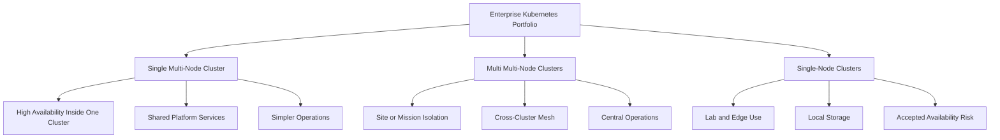
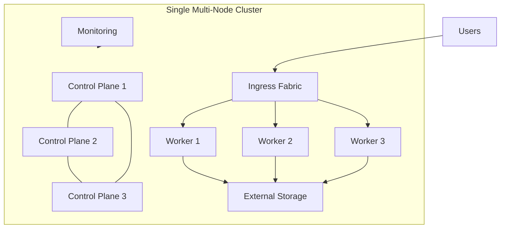
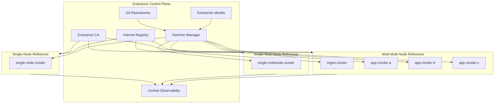
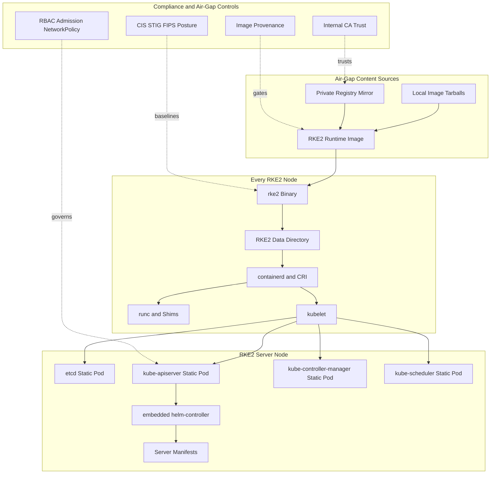
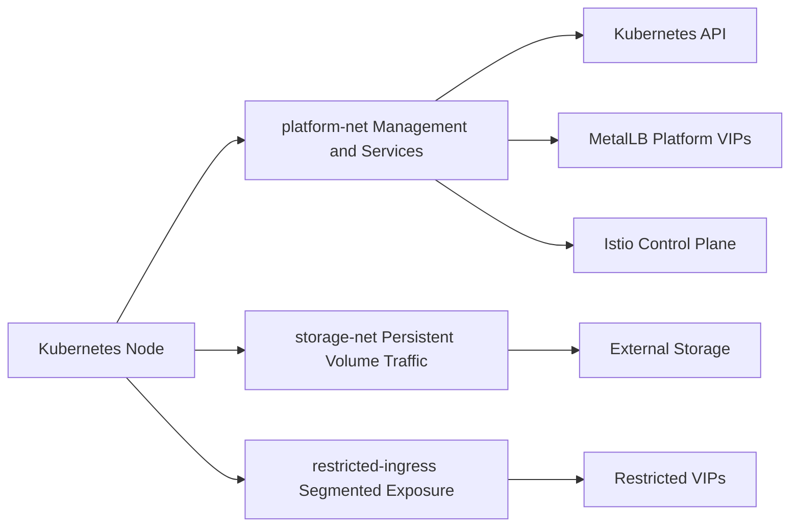
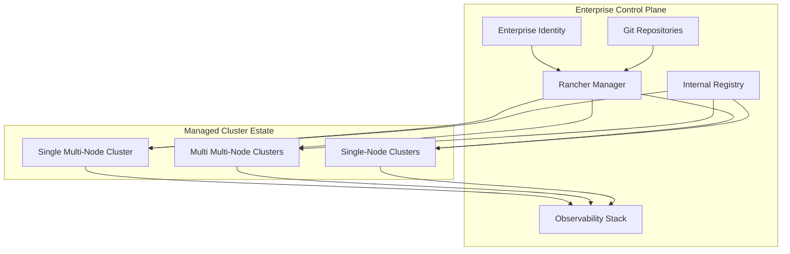
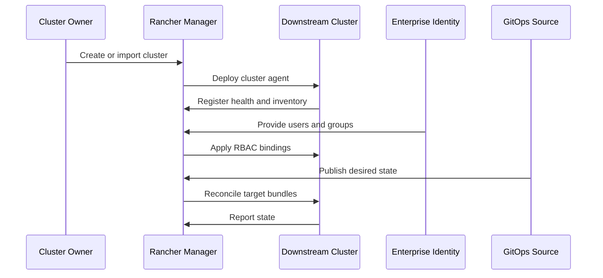
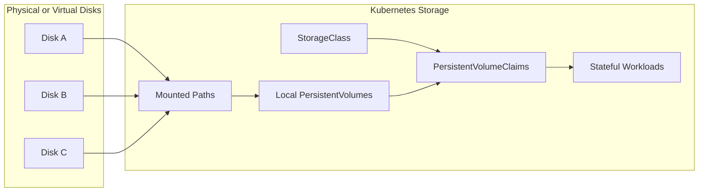

# K8s Mystical Mesh System Design Document

> **Public release rewrite note:** This file uses public-safe cluster names, DNS names, paths, and RFC documentation IP ranges. It preserves the platform design intent but is not a live deployment inventory.

**Reference Architecture Environment**  
**Version:** 2.0  
**Date:** July 1, 2026

---

## Table of Contents

1. [Executive Summary](#executive-summary)
2. [Cluster Portfolio Model](#cluster-portfolio-model)
3. [System Architecture Overview](#system-architecture-overview)
4. [RKE2 Distribution and Node Lifecycle](#rke2-distribution-and-node-lifecycle)
5. [Cluster Topology](#cluster-topology)
6. [Network and Ingress Architecture](#network-and-ingress-architecture)
7. [Rancher Enterprise Management](#rancher-enterprise-management)
8. [Air-Gapped Image Supply Chain](#air-gapped-image-supply-chain)
9. [Storage Architecture](#storage-architecture)
10. [Security Architecture](#security-architecture)
11. [Service Mesh Architecture](#service-mesh-architecture)
12. [Monitoring and Observability](#monitoring-and-observability)
13. [Application and Data Platform](#application-and-data-platform)
14. [Configuration and Resource Baseline](#configuration-and-resource-baseline)
15. [Scheduling and Disruption Policy](#scheduling-and-disruption-policy)
16. [Operations and Validation](#operations-and-validation)
17. [Emergency and Recovery Procedures](#emergency-and-recovery-procedures)
18. [Recommendations and Backlog](#recommendations-and-backlog)
19. [Appendix: Consolidated Source Map](#appendix-consolidated-source-map)

---

## Executive Summary

K8s Mystical Mesh is a public-safe reference architecture for an air-gapped, enterprise Kubernetes platform. The architecture supports three cluster deployment categories:

1. **Single multi-node cluster** — one resilient cluster for shared platform services or application workloads.
2. **Multi multi-node clusters** — multiple resilient clusters across sites, missions, or security domains.
3. **Single-node clusters** — constrained lab, edge, demo, or disconnected validation clusters with explicit availability caveats.

The platform baseline includes RKE2, Rancher Manager, an internal registry, Kubernetes ingress segmentation, Istio service mesh, centralized observability, hardened workload security contexts, NetworkPolicies, persistent storage patterns, and operational runbooks. The design is optimized for disconnected or regulated environments where the registry, certificates, node lifecycle, image provenance, and deployment evidence all matter.

### Core Design Principles

- Use **Rancher Manager** as the enterprise cluster operating console.
- Treat the **internal registry** as a Tier-0 dependency in air-gapped environments.
- Keep **cluster categories explicit** so single-node, single-cluster, and multi-cluster designs do not blur risk assumptions.
- Separate **platform ingress** from **restricted ingress** to reduce routing ambiguity and blast radius.
- Use **RKE2** for a predictable, supportable, compliant Kubernetes distribution lifecycle.
- Apply **security context hardening**, **default-deny-ready NetworkPolicies**, and **least-privilege RBAC** as platform defaults.
- Monitor infrastructure, mesh, ingress, application, database, and messaging layers through a centralized observability model.

---

## Cluster Portfolio Model

The cluster portfolio model is the architecture anchor for this documentation package. `docs/Cluster-Portfolio-Strategy.md` remains as the short decision guide. This SDD is the consolidated detail document.



### Category Decision Matrix

| Requirement | Single Multi-Node | Multi Multi-Node | Single-Node |
| --- | --- | --- | --- |
| High availability | Strong | Strongest | Weak |
| Operational simplicity | Strong | Moderate | Strong |
| Security isolation | Moderate | Strongest | Moderate |
| Cost efficiency | Moderate | Weak | Strong |
| Edge or lab fit | Moderate | Weak | Strong |
| Enterprise governance | Strong | Strongest | Moderate with Rancher |
| Disaster recovery | Moderate | Strong | Manual and backup-driven |

### Category 1: Single Multi-Node Cluster

A single multi-node cluster is the default target when the enterprise needs Kubernetes resiliency but does not need separate cluster fault domains.

| Attribute | Standard |
| --- | --- |
| Control plane | Three or more server nodes |
| Worker capacity | Dedicated worker nodes |
| Storage | External CSI-backed storage preferred |
| Ingress | Redundant ingress replicas |
| Operations | One lifecycle domain |
| Best fit | Department platform, shared services, internal applications |



### Category 2: Multi Multi-Node Clusters

Multi multi-node clusters are used when mission boundaries, sites, security domains, or resiliency requirements justify multiple fully resilient clusters.

| Attribute | Standard |
| --- | --- |
| Control plane | Three or more server nodes per cluster |
| Worker capacity | Dedicated worker nodes per cluster |
| Management | Centralized Rancher Manager |
| GitOps | Fleet or Argo CD by target group |
| Observability | Central aggregation with cluster labels |
| Best fit | Enterprise platform, segmented missions, multi-site operations |

### Category 3: Single-Node Clusters

Single-node clusters are valid for labs, edge locations, demos, developer sandboxes, and constrained test environments. They are not equivalent to high-availability production clusters.

| Attribute | Standard |
| --- | --- |
| Control plane | One server node |
| Worker capacity | Co-located on the same node |
| Storage | Local disks or constrained external storage |
| Management | Imported into Rancher for visibility and governance |
| Availability | Host-level fault domain |
| Best fit | Lab, edge, disconnected test, proof-of-concept |

A single-node cluster can be useful, but it is not resilient. The trade is cost and simplicity in exchange for a larger failure domain.

---

## System Architecture Overview

The reference platform centers on a Rancher-managed estate, internal image registry, RKE2 cluster lifecycle, segmented ingress, centralized monitoring, and workload/data services.



### Core Platform Components

| Component | Role |
| --- | --- |
| RKE2 | Kubernetes distribution and node lifecycle baseline |
| Rancher Manager | Central cluster management, RBAC, UI, policy, and lifecycle visibility |
| Internal Registry | Air-gapped image source of truth |
| cert-manager | Certificate automation |
| MetalLB | Bare-metal LoadBalancer VIP allocation |
| Contour / Envoy | L7 ingress controller for platform and restricted ingress planes |
| Istio | Service mesh, mTLS, telemetry, and east-west gateways |
| Prometheus / Alertmanager | Central metrics storage, alerting, and remote-write intake |
| Grafana | Dashboards backed by PostgreSQL configuration storage |
| Kiali | Mesh visualization integrated with central Prometheus and Grafana |
| NetApp Trident | CSI storage provisioning for multi-node clusters |
| Local PVs | Constrained storage option for single-node clusters |
| Rocket.Chat | Primary application workload reference |
| MongoDB Operator / Ops Manager | Multi-cluster database lifecycle and replication |
| NATS | Messaging substrate and event-delivery layer |
| Keycloak | Identity plane and realm-managed authentication services |

---

## RKE2 Distribution and Node Lifecycle

RKE2 is the Kubernetes distribution baseline. It packages the runtime path into a predictable node lifecycle. Each node installs a single RKE2 binary, starts in server or agent mode, bootstraps runtime content, supervises containerd and kubelet, and starts server-side control-plane components as static pods where applicable.



### Design Implications

- Runtime images, Kubernetes component images, CNI images, and add-on charts must be mirrored and validated before bootstrap.
- Server and agent nodes use the same distribution model, with behavior driven by configuration.
- RKE2 helps reduce compliance drift because runtime, kubelet, and static pod lifecycle are predictable.
- The private registry mirror is a mission-critical dependency and needs HA, backup, certificate, monitoring, and alerting treatment.
- The platform team still owns configuration, patch cadence, registry hygiene, monitoring, backup, and policy enforcement.

---

## Cluster Topology

The multi multi-node reference architecture uses four public-safe clusters.

| Cluster | Site | Role | Primary Functions |
| --- | --- | --- | --- |
| `mgmt-cluster` | Site A | Management | Rancher, central monitoring, Grafana, Alertmanager, Kiali integration, Argo CD, MongoDB control functions |
| `app-cluster-a` | Site A | Application | Rocket.Chat, MongoDB members, NATS, Keycloak/application services |
| `app-cluster-b` | Site B | Application | Application workloads and data replicas |
| `app-cluster-c` | Site C | Application | Application workloads and data replicas |

### Network Segment Model

| Segment | Documentation IP Space | Purpose |
| --- | --- | --- |
| `out-of-band-mgmt` | `203.0.113.200-203.0.113.323` | Infrastructure management and lab OOB services |
| `platform-net` | `192.0.2.0/24` | Kubernetes admin, cluster nodes, and platform services |
| `storage-net` | `203.0.113.10-203.0.113.47` | Persistent volume storage traffic |
| `restricted-ingress` | `198.51.100.128/25` | Segmented ingress and constrained workload exposure |

### Multi-Cluster IP Matrix

| Cluster | Node IP Range | Storage IP Range | Restricted Range | Platform VIP | Restricted VIP | Service CIDR | Pod CIDR |
| --- | --- | --- | --- | ---: | ---: | --- | --- |
| `mgmt-cluster` | `192.0.2.10-192.0.2.19` | `203.0.113.10-203.0.113.17` | `192.0.2.110-192.0.2.119` | `198.51.100.15` | `198.51.100.114` | `SERVICE-CIDR-MGMT` | `POD-CIDR-MGMT` |
| `app-cluster-a` | `192.0.2.20-192.0.2.29` | `203.0.113.20-203.0.113.26` | `192.0.2.120-192.0.2.129` | `198.51.100.25` | `198.51.100.124` | `SERVICE-CIDR-APP-A` | `POD-CIDR-APP-A` |
| `app-cluster-b` | `192.0.2.30-192.0.2.39` | `203.0.113.30-203.0.113.36` | `192.0.2.130-192.0.2.139` | `198.51.100.35` | `198.51.100.134` | `SERVICE-CIDR-APP-B` | `POD-CIDR-APP-B` |
| `app-cluster-c` | `192.0.2.40-192.0.2.49` | `203.0.113.40-203.0.113.46` | `192.0.2.140-192.0.2.149` | `198.51.100.45` | `198.51.100.144` | `SERVICE-CIDR-APP-C` | `POD-CIDR-APP-C` |

### Node Inventory Pattern

| Cluster | Control Plane | Workers | Spare | Notes |
| --- | ---: | ---: | ---: | --- |
| `mgmt-cluster` | 3 | 4 | 1 | Management and central observability capacity |
| `app-cluster-a` | 3 | 3 | 1 | Site A application capacity |
| `app-cluster-b` | 3 | 3 | 1 | Site B application capacity |
| `app-cluster-c` | 3 | 3 | 1 | Site C application capacity |

---

## Network and Ingress Architecture

The platform uses explicit traffic segmentation and two ingress planes. The point is not cosmetics; it is blast-radius control. A bad route or overly broad host rule on a restricted path should not land behind the same Envoy service and namespace as normal platform services.

### Three-Network Node Model



### Ingress Plane Separation

| Plane | Namespace | IngressClass | Intended Use |
| --- | --- | --- | --- |
| `platform-ingress` | `platform-ingress` | `platform-ingress` | Core platform, management, shared platform, and standard developer access |
| `restricted-ingress` | `restricted-ingress` | `restricted-ingress` | Segmented workload exposure and higher-risk test paths |

### Required Guardrails

- `platform-ingress` may be the only default IngressClass.
- `restricted-ingress` must not be marked default.
- Every Ingress and HTTPProxy must explicitly declare the intended class.
- Control-plane services such as Grafana, Prometheus, Alertmanager, and Kiali stay on `platform-ingress` unless segmented exposure is explicitly approved.
- Do not share one hostname across platform and restricted ingress unless split-horizon behavior is deliberate and documented.
- Add NetworkPolicies by namespace. Namespace separation does not become a real security boundary until policy follows.

### Ingress VIP Summary

| Cluster | platform-ingress VIP | restricted-ingress VIP |
| --- | ---: | ---: |
| `mgmt-cluster` | `198.51.100.15` | `198.51.100.114` |
| `app-cluster-a` | `198.51.100.25` | `198.51.100.124` |
| `app-cluster-b` | `198.51.100.35` | `198.51.100.134` |
| `app-cluster-c` | `198.51.100.45` | `198.51.100.144` |

### Service Endpoint Summary

| Service | Endpoint | Protocol | Purpose |
| --- | --- | --- | --- |
| Application UI | `rocket.platform.example.internal` | HTTP/HTTPS | User-facing application service |
| Internal registry | `registry.example.internal:8443` | HTTPS | Container image repository |
| External storage NFS | `storage.example.internal` | NFS | File-backed persistent volumes |
| External storage iSCSI | `storage.example.internal` | iSCSI | Block-backed persistent volumes |
| Istio east-west gateway | Per-cluster LoadBalancer | mTLS | Cross-cluster service mesh traffic |

---

## Rancher Enterprise Management

Rancher Manager is the enterprise control point for all cluster categories. It provides centralized visibility, authentication integration, access governance, projects, applications, monitoring views, security posture visibility, and cluster lifecycle workflows. Each cluster still retains its own Kubernetes API, runtime, and failure domain.



### Rancher UI Operating Areas

| Area | Purpose | Enterprise Outcome |
| --- | --- | --- |
| Cluster Explorer | Inspect workloads, namespaces, nodes, storage, and events | Single pane of glass |
| Cluster Management | Register, import, upgrade, and manage clusters | Standard lifecycle control |
| Users and Authentication | Integrate enterprise identity and groups | Central access governance |
| Projects and Namespaces | Group namespaces with delegated RBAC | Cleaner ownership model |
| Apps and Charts | Deploy approved platform services | Controlled self-service |
| Monitoring | View health and capacity | Faster incident triage |
| Fleet | GitOps deployment to target clusters | Repeatable configuration |
| Security and Policy | Run scans and enforce standards | Audit-ready operations |

### Cluster Onboarding Flow



### Category-Specific Rancher Use

| Cluster Category | Rancher Use | Guardrail |
| --- | --- | --- |
| Single multi-node cluster | Primary lifecycle, RBAC, projects, monitoring, apps | Use HA storage and redundant ingress. |
| Multi multi-node clusters | Central estate management, Fleet targeting, cross-cluster visibility | Keep cluster labels and ownership clean. |
| Single-node clusters | Import for visibility, policy, inventory, and lifecycle awareness | Do not market as HA. Backup is mandatory. |

### Fleet Targeting Model

Use cluster labels such as `production=true`, `lab=true`, `site=site-a`, and `category=single-node` to target bundles cleanly. Label design matters; sloppy labels become sloppy deployments.

---

## Air-Gapped Image Supply Chain

In an air-gapped Kubernetes environment, the image supply chain is a Tier-0 platform dependency. Missing images, inconsistent retagging, weak registry ownership, or untrusted certificates break downstream deployment automation.

### Repository Ownership Model

| Capability | Image promotion utility | Registry lifecycle utility | Platform deployment repo |
| --- | --- | --- | --- |
| Source image catalog | Owns | References | Consumes expected output |
| Image list normalization | Owns | Does not own | Does not own |
| Connected pull workflow | Owns | Does not own | Does not own |
| Offline/internal push workflow | Owns | Delegates to registry endpoint | Consumes promoted images |
| Registry install/runtime lifecycle | Does not own | Owns | Does not own |
| TLS and client trust lifecycle | Requires working trust | Owns | Validates from nodes |
| Helm/YAML deployment | Does not own | Does not own | Owns |

### Standard Workflow

1. Maintain source image lists for Kubernetes distribution components, add-ons, ingress, monitoring, service mesh, data services, and tools.
2. Normalize and categorize image lists into public/no-auth, authenticated registry, archived, and aggregate manifests.
3. Pull images while connected, using credentials only where required.
4. Stage or deploy the internal registry before platform rollout.
5. Retag and push images into the internal registry using a deterministic promotion mode.
6. Validate image availability and registry trust from the target environment before cluster deployment.

### Registry Naming Contract

The preferred promotion mode strips the upstream registry prefix and places the image under the internal registry project or namespace. A preserve-registry mode can be used when upstream path collisions are a material risk.

Platform manifests and Helm values must use the same mapping contract as the promotion workflow. If they drift, the cluster fails with image pull errors even when the registry is healthy.

### Pre-Deployment Gates

- Image manifest count matches the expected bill of materials.
- No critical images remain in failed-pull or missing-image logs.
- Internal registry projects/namespaces exist.
- Push account permissions are correct.
- Node runtime trusts the registry certificate chain.
- At least one representative image pull succeeds from a target node.

### Failure Modes

| Failure | Likely Cause | Corrective Action |
| --- | --- | --- |
| Image pull errors | Manifests do not match internal registry promotion mode | Reconcile values/manifests with target mapping |
| Push denied | Account lacks project or repository permissions | Use push-scoped or project-management credential |
| Project creation fails | Service account cannot create registry projects | Use registry administrator or preflight project-management account |
| TLS trust failure | Node runtime does not trust registry CA | Install CA in runtime trust store and restart runtime |
| Missing pushed image | Source image skipped, failed, or normalized differently | Review pull/push logs and rerun workflow |

Bottom line: production rollout should not be the first time the team discovers an image is missing. That failure class belongs in preflight.

---

## Storage Architecture

### Multi-Node Storage

NetApp Trident provides the CSI storage abstraction for multi-node clusters. It maps Kubernetes PVC intent into backend storage provisioning workflows across file and block profiles. Late-binding storage classes improve placement correctness by deferring volume binding until the scheduler has workload context.

Storage is not just capacity infrastructure. It is a performance and failure-domain control surface for Prometheus, Alertmanager, Grafana PostgreSQL, MongoDB, Keycloak PostgreSQL, and application state.

### Single-Node Local Storage

Single-node clusters may use local disks or mounted local paths for persistent volumes.



### Local Storage Caveat

Local persistent volumes bind workload availability to the health of the node and local disk. That is acceptable for labs and edge-style validation, but it requires backup, restore, and rebuild testing before stateful workloads are promoted.

---

## Security Architecture

The current security baseline includes hardened pod security contexts, namespace-segmented NetworkPolicies, expanded default-deny automation coverage, ingress separation, and stronger monitoring access controls.

**Current Risk Level:** Medium — network segmentation and security contexts are enforced, with remaining hardening gaps.  
**Target Risk Level:** Low — strict mesh mTLS, NATS TLS default-on, Pod Security Admission enforcement, and default-deny policy coverage completed.

### Implemented Controls

| Control | Current Posture |
| --- | --- |
| runAsNonRoot | Enforced on hardened application and infrastructure workloads |
| Linux capabilities | Drop ALL by default, add only required capabilities |
| seccomp | RuntimeDefault profile enforced |
| privilege escalation | `allowPrivilegeEscalation: false` where supported |
| NetworkPolicies | Application and infrastructure allow policies present |
| default deny | Template and automation available; rollout requires validation |
| namespace segmentation | Platform, restricted, monitoring, application, data, and messaging namespaces separated |
| Kiali/Grafana access | Uses routed HTTPS FQDNs and Grafana service-account token |

### NetworkPolicy Coverage

| Namespace / Area | Policy Intent |
| --- | --- |
| Rocket.Chat | Allow ingress from ingress controller and metrics; egress to MongoDB, NATS, DNS, Kubernetes API, and mesh paths |
| MongoDB | Allow application queries, operator management, replica communication, exporter metrics, and mesh gateway replication paths |
| NATS | Allow application clients, cluster routes, exporter metrics, and DNS |
| Monitoring | Allow Grafana, Prometheus, Alertmanager, Kiali integration, remote write, web UI, DNS, and Kubernetes API paths |
| Keycloak | Constrain realm/application paths and database egress with namespace/pod scoped policies |
| Default deny | Deny all ingress and egress, then layer DNS and explicit allow policies |

### Security Deployment Phases

| Phase | Action | Risk |
| --- | --- | --- |
| 1 | Deploy security contexts | Low |
| 2 | Deploy application NetworkPolicies | Medium |
| 3 | Deploy default-deny policies | High unless all dependencies are mapped |

### Remaining Security Backlog

1. Replace Kiali anonymous UI authentication before exposing it outside a sealed admin lab.
2. Add default-deny NetworkPolicies directly to platform and restricted ingress namespaces.
3. Add explicit allow lists for Envoy ingress to backend namespaces.
4. Codify Istio mesh-wide strict mTLS with namespace-specific exceptions where required.
5. Enforce Pod Security Admission labels instead of leaving them as commented guidance.

---

## Service Mesh Architecture

Istio provides traffic management, workload identity, mTLS, telemetry, and east-west gateway connectivity. The platform uses revision-based injection and should avoid mixing `istio.io/rev` with legacy `istio-injection` labels.

### Sidecar Placement Policy

| Namespace / Workload | Sidecar Policy | Reason |
| --- | --- | --- |
| Rocket.Chat application pods | Injected | Application traffic should be visible in Kiali and Istio telemetry |
| Keycloak pods | Explicit pod-level injection | Application workload, but namespaces also contain platform dependencies |
| Istio east-west gateways | Injected by gateway chart | Gateway workloads are part of the data plane |
| `istio-system` control-plane pods | Not injected | istiod, Kiali, and operators are control-plane components |
| `monitoring` | Not injected | Observability services should not become mesh workload noise by default |
| `metallb-system` | Not injected | Infrastructure component with native metrics |
| `nats-system` | Not injected | Uses chart-native protocol and exporter |
| `mongodb` / `mongodb-operator` | Not injected | Uses operator-managed TLS and database-specific monitoring |
| Contour/Envoy namespaces | Not injected | L7 ingress controllers are separate from Istio sidecar data plane |

### East-West Gateway Pattern

Service mesh east-west gateways expose constrained cross-cluster traffic, commonly on port `15443`, through per-cluster LoadBalancer services. Cross-cluster traffic must preserve certificate trust and identity semantics.

---

## Monitoring and Observability

The monitoring design uses Prometheus Agent in every cluster, remote-writing to the central Prometheus server in `mgmt-cluster`. Grafana uses PostgreSQL for configuration state. Alertmanager handles alert routing. Kiali integrates with central Prometheus and Grafana using routable HTTPS endpoints.

### Metrics Coverage

| Area | Collection Pattern |
| --- | --- |
| Kubernetes core | kube-state-metrics, node-exporter, kubelet, cAdvisor |
| Istio control plane | `istiod` ServiceMonitor |
| Istio gateways | Gateway metrics endpoint |
| Istio sidecars | PodMonitor selecting injected pods |
| Rocket.Chat | Chart-native PodMonitor |
| NATS | Prometheus exporter PodMonitor |
| MetalLB | Chart-provided ServiceMonitors enabled after monitoring CRDs exist |
| MongoDB operator | Explicit ServiceMonitor |
| MongoDB database internals | Backlog: enable MongoDB CR `spec.prometheus` and credentials |
| Keycloak | Keycloak CR `serviceMonitor` setting |
| PostgreSQL internals | Backlog: add postgres exporter pattern |

### Monitoring Baseline Updates

- Grafana uses dedicated PostgreSQL in the `monitoring` namespace.
- Prometheus and Alertmanager use native storage models and are not moved to PostgreSQL.
- Kiali reaches central Grafana and Prometheus through routable `platform.example.internal` HTTPS endpoints, not cross-cluster `.svc` DNS.
- Kiali uses a Grafana service-account token stored in a `kiali-grafana-credentials` Secret in each cluster's `istio-system` namespace.
- Prometheus central TSDB uses `walCompression: true` and an explicit `retentionSize` below PVC capacity.

### Known Observability Backlog

1. Add PostgreSQL exporter coverage for database-level internals such as connection count, locks, cache hit ratio, and slow query indicators.
2. Enable MongoDB database/member metrics with credentials and matching ServiceMonitor wiring.
3. Add Prometheus cardinality dashboards and alerts before onboarding more services.
4. Add Alertmanager receiver configuration and test routing end-to-end.

---

## Application and Data Platform

### Rocket.Chat

Rocket.Chat is the primary application workload and validates the surrounding platform stack. It depends on MongoDB for persistence, NATS for asynchronous/event paths, ingress for external access, mesh for workload traffic control where enabled, and Prometheus for telemetry.

### MongoDB

MongoDB is deployed as a multi-cluster data fabric managed by the MongoDB Kubernetes Operator. The reference model distributes replica set members across application clusters and uses Ops Manager for lifecycle management. Database reliability is integrated into the platform control loops for deployment, telemetry, and security.

### NATS

NATS provides the asynchronous messaging substrate. Exporter metrics and policy controls make queue depth, connection churn, and message rates visible to the platform before they become application outages.

### Keycloak

Keycloak provides the identity plane for users, applications, and external identity sources. Realm configuration should remain versioned, reproducible, and tied to policy controls. Pod-level sidecar injection is preferred over broad namespace injection where identity namespaces contain supporting dependencies.

---

## Configuration and Resource Baseline

The current baseline targets a 3k-5k continuous user reference range.

### Workload Defaults

| Area | Baseline |
| --- | --- |
| Contour | `replicaCount: 3` with explicit Contour and Envoy resources |
| Rocket.Chat | `replicaCount: 4`, `minAvailable: 4`, microservices at 3 replicas each |
| Rocket.Chat HPAs | Main, DDP streamer, presence, account, authorization, stream hub |
| Keycloak | 3 instances per referenced realm, 1 CPU/2Gi request, 2 CPU/4Gi limit |
| MongoDB | 2 members per application cluster; secondary vote configuration added |
| Ops Manager | 2 replicas, application database members increased |
| Monitoring | Explicit Prometheus CPU limits by manager/application cluster profile |
| Trident Protect | Explicit controller and job default resources |

### Minimum Baseline Subtotals

| Workload Tier | Scale Assumption | Requested CPU | Requested Memory | Limit CPU | Limit Memory |
| --- | --- | ---: | ---: | ---: | ---: |
| Ingress Contour | 3 replicas x 4 clusters | 3.00 | 4.5Gi | 12.00 | 12Gi |
| Ingress Envoy minimum | 1 pod x 4 clusters | 2.00 | 2Gi | 8.00 | 6Gi |
| Rocket.Chat | base replicas | 5.50 | 15.5Gi | 20.00 | 31Gi |
| Keycloak | 4 deployments x 3 instances | 12.00 | 24Gi | 24.00 | 48Gi |
| MongoDB + Ops Manager | multicluster + opsmanager | 8.80 | 23Gi | 32.00 | 64Gi |
| Monitoring | 1 manager + 3 application clusters | 1.90 | 7Gi | 12.00 | 18Gi |
| Mongo Express | 1 pod x 4 clusters | 0.40 | 0.5Gi | 2.00 | 2Gi |
| Trident Protect | controller + 1 concurrent job | 1.25 | 2.5Gi | 6.00 | 10Gi |
| **Grand Total** | all tiers combined | **34.85** | **79Gi** | **116.00** | **191Gi** |

### Full 5k User Capacity Target

| Capacity Target | Requested CPU | Requested Memory | Limit CPU | Limit Memory |
| --- | ---: | ---: | ---: | ---: |
| Minimum baseline | 34.85 | 79Gi | 116.00 | 191Gi |
| Full 5k target | 51.35 | 137.5Gi | 188.00 | 308Gi |

Recommended planning headroom for stable operations at 5k is at least 20% above requests: about 61.6 allocatable CPU cores and 165Gi allocatable memory.

---

## Scheduling and Disruption Policy

The scheduling posture spreads replicated workloads where it matters, avoids hard scheduling deadlocks, and keeps node drains from turning into platform outages.

| Workload Area | Scheduling Policy | Disruption Policy |
| --- | --- | --- |
| Rocket.Chat core | Soft pod anti-affinity by hostname | Main deployment allows one voluntary disruption |
| Rocket.Chat microservices | Soft pod anti-affinity by service | Explicit PDBs with `maxUnavailable: 1` |
| Contour control plane | Soft anti-affinity plus hostname topology spread | Explicit PDB with `maxUnavailable: 1` |
| Envoy ingress data plane | DaemonSet placement | No PDB; DaemonSet/node lifecycle handles placement |
| NATS | Hostname topology spread | PDB enabled, `maxUnavailable: 1` |
| Keycloak realms | Host anti-affinity plus topology spread | Explicit PDB with `maxUnavailable: 1` |
| PostgreSQL singletons | No artificial PDB | Single-replica databases must remain drain-able |
| Prometheus / Alertmanager / Grafana singletons | No artificial PDB | Single-replica monitoring services should not block maintenance |
| MongoDBMultiCluster members | One member per Kubernetes cluster | Resiliency comes from multi-cluster replica set design |

A PDB that requires every replica to remain available looks resilient on paper but blocks voluntary disruption. Drain-safe policy is the better engineering trade.

---

## Operations and Validation

### Common Cluster Operations

```bash
kubectl config get-contexts
kubectl config use-context mgmt-cluster
kubectl get nodes -o wide
kubectl get pods -A | grep -v Running
kubectl top nodes
kubectl top pods -A
```

### Ingress Validation

```bash
for ctx in mgmt-cluster app-cluster-a app-cluster-b app-cluster-c; do
  echo "===== ${ctx} ====="
  kubectl --context "${ctx}" get ingressclass
  kubectl --context "${ctx}" get svc -n platform-ingress
  kubectl --context "${ctx}" get svc -n restricted-ingress
  kubectl --context "${ctx}" get ingress -A
  kubectl --context "${ctx}" get httpproxy -A 2>/dev/null || true
  echo
done
```

Expected state:

- `platform-ingress` exists and may be default.
- `restricted-ingress` exists and is not default.
- Every exposed object declares the intended ingress class.

### Service Mesh Validation

```bash
kubectl get pods -n istio-system
kubectl get svc -n istio-system | grep eastwest
istioctl proxy-status
istioctl analyze -A
```

Expected state:

- Infrastructure namespaces are not broadly sidecar-injected.
- Application workloads that require mesh behavior have sidecars.
- ServiceMonitor and PodMonitor objects exist for the platform components that should be scraped.

### Monitoring Validation

```bash
kubectl port-forward -n monitoring svc/prometheus-operated 9090:9090
kubectl port-forward -n monitoring svc/prometheus-grafana 3000:80
kubectl get servicemonitor -A
kubectl get podmonitor -A
kubectl get prometheusrule -A
```

Grafana PostgreSQL mode check:

```bash
kubectl --context mgmt-cluster -n monitoring exec deploy/mgmt-cluster-server-grafana -- \
  printenv GF_DATABASE_TYPE GF_DATABASE_HOST GF_DATABASE_NAME
```

Expected database type: `postgres`.

### Storage Validation

```bash
kubectl get sc
kubectl get pvc -A
kubectl get pods -n trident-system
kubectl logs -n trident-system deploy/trident-operator-controller
```

### Security Validation

```bash
kubectl get ns -L pod-security.kubernetes.io/enforce
kubectl get networkpolicy -A
kubectl get clusterrolebindings
kubectl auth can-i --list --as=system:serviceaccount:<namespace>:<serviceaccount>
```

### Resource Coverage Check

```bash
python3 - <<'PY'
import pathlib, yaml
kinds={'Deployment','StatefulSet','DaemonSet','Job','CronJob'}
for p in pathlib.Path('build').rglob('*.yaml'):
    try:
        docs=list(yaml.safe_load_all(p.read_text()))
    except Exception:
        continue
    for d in docs:
        if not isinstance(d,dict) or d.get('kind') not in kinds:
            continue
        spec=d.get('spec',{})
        tpl=spec.get('template',{})
        if d.get('kind')=='CronJob':
            tpl=spec.get('jobTemplate',{}).get('spec',{}).get('template',{})
        ps=tpl.get('spec',{})
        for c in ps.get('initContainers',[])+ps.get('containers',[]):
            if 'resources' not in c:
                print(p, d.get('kind'), d.get('metadata',{}).get('name'), c.get('name'))
PY
```

### Prometheus Query Starters

```promql
sum(rate(container_cpu_usage_seconds_total{pod!=""}[5m])) by (pod, namespace)
sum(container_memory_working_set_bytes{pod!=""}) by (pod, namespace)
sum(kube_pod_container_status_restarts_total) by (namespace, pod)
(kubelet_volume_stats_used_bytes / kubelet_volume_stats_capacity_bytes) * 100
mongodb_mongod_replset_member_replication_lag
rate(nats_varz_in_msgs[5m])
sum(rate(istio_requests_total[5m])) by (source_workload, destination_workload)
```

---

## Emergency and Recovery Procedures

### Complete Cluster Failure

1. Check infrastructure reachability and API status.
2. Check control-plane pods and logs.
3. Check etcd health.
4. Validate storage and registry dependencies.
5. Restore from backup if control-plane or stateful recovery is required.

```bash
kubectl cluster-info
kubectl get nodes
kubectl get pods -n kube-system
kubectl logs -n kube-system -l component=kube-apiserver
kubectl get pods -n kube-system -l component=etcd
```

### Service Degradation

1. Identify failing pods and recent events.
2. Check node and pod resource constraints.
3. Scale replicated workloads if capacity exists.
4. Restart stuck pods only after dependency checks.

```bash
kubectl get pods -A | grep -v Running
kubectl get events -A --sort-by='.lastTimestamp' | tail -20
kubectl top nodes
kubectl describe node <node-name>
```

### Data Loss Prevention

1. Take an immediate backup/snapshot where possible.
2. Prevent further writes if data consistency is at risk.
3. Investigate before restoring.
4. Validate restored application, database, and ingress paths.

For single-node clusters, recovery planning is mandatory because host loss, OS corruption, disk failure, and local PV loss all share the same failure domain.

### Escalation Criteria

| Escalation | Trigger |
| --- | --- |
| L1 to L2 | Service down more than 15 minutes, data inconsistency suspected, security incident suspected, repeated restart failures |
| L2 to L3 | Multi-cluster failure, confirmed data loss, confirmed breach, architecture change needed |

---

## Recommendations and Backlog

### Documentation Backlog

- Add a future `Single-Multi-Node-Cluster-Reference` section inside this SDD if the single-cluster production pattern becomes a first-class build target.
- Add deeper backup and restore standards by cluster category.
- Add Rancher RBAC group mapping once real enterprise group names are approved for private docs.
- Regenerate diagram exports from the consolidated SDD and portfolio document.

### Technical Backlog

1. Enforce Pod Security Admission labels instead of leaving them as commented guidance.
2. Codify mesh-wide strict mTLS with namespace-specific exceptions.
3. Add default-deny policies to both ingress namespaces.
4. Add explicit Envoy-to-backend allow lists.
5. Add PostgreSQL exporter coverage.
6. Enable MongoDB database/member metrics with proper credentials.
7. Add Alertmanager receivers and test routing.
8. Add Prometheus cardinality dashboards and alerts.
9. Formalize single-node backup and rebuild testing before stateful workload promotion.

---

## Appendix: Consolidated Source Map

This SDD consolidates the content previously spread across these Markdown files:

| Previous Document | Integrated Into |
| --- | --- |
| `docs/Air-Gap-Image-Supply-Chain.md` | Air-Gapped Image Supply Chain |
| `docs/RKE2-Distribution-Architecture.md` | RKE2 Distribution and Node Lifecycle |
| `docs/Operations-Quick-Reference.md` | Operations and Validation; Emergency and Recovery Procedures |
| `docs/Network-IP-Matrix.md` | Cluster Topology; Network and Ingress Architecture |
| `docs/Configuration-Baseline.md` | Configuration and Resource Baseline; Security; Monitoring; Scheduling |
| `docs/Resource-and-Performance-Review.md` | Monitoring and Observability; Configuration and Resource Baseline; Recommendations |
| `docs/Ingress-Segmentation-Design.md` | Network and Ingress Architecture |
| `docs/Istio-Sidecar-and-Metrics-Design.md` | Service Mesh Architecture; Monitoring and Observability |
| `docs/Scheduler-and-Disruption-Policy-Review.md` | Scheduling and Disruption Policy |
| `docs/Security-Implementation-Summary.md` | Security Architecture; Operations and Validation |
| `docs/Rancher-Enterprise-Cluster-Management.md` | Rancher Enterprise Management |
| `docs/Single-Node-Cluster-Reference.md` | Cluster Portfolio Model; Storage; Emergency and Recovery |
| `docs/README.md` | Repository README and this SDD |

`docs/Cluster-Portfolio-Strategy.md` remains as the concise portfolio decision guide and should be kept in sync with this SDD.
